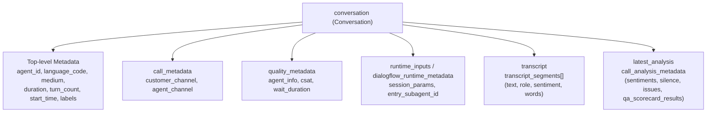

# Contact Center AI Insights CEL Cookbook & Reference Guide

This document is a comprehensive reference for authoring Common Expression Language (CEL) rules for Google Cloud Contact Center AI (CCAI) Insights Autolabeling Rules.

______________________________________________________________________

## 1. Overview & Evaluation Semantics

Autolabeling rules evaluate incoming conversations in real-time or during batch ingestion.

- **Evaluation Order**: Conditions are evaluated sequentially from top to bottom (first-match-wins).
- **Fallback Rules**: The last condition should always have an empty condition `condition: ""` to act as the default fallback tag.
- **String Literals**: Values in CEL expressions or return values should be properly quoted (e.g. `'vip_tier'`, `"support"`).
- **Return Value**: The matched `value` expression is assigned to the conversation's `labels[label_key]`.

______________________________________________________________________

## 2. Conversation Resource Schema (`resources.proto`)

In CEL expressions, the root `conversation` variable provides direct access to the full `google.cloud.contactcenterinsights.v1.Conversation` protobuf message.



### 2.1 Top-Level Attributes

| Field Path                   | Type                  | Description                                                   | CEL Example                                                              |
| ---------------------------- | --------------------- | ------------------------------------------------------------- | ------------------------------------------------------------------------ |
| `conversation.name`          | `string`              | Full resource name (`projects/*/locations/*/conversations/*`) | `conversation.name.endsWith('/conv123')`                                 |
| `conversation.agent_id`      | `string`              | Identifier of virtual agent / CXAS app / bot                  | `conversation.agent_id == 'billing_bot'`                                 |
| `conversation.language_code` | `string`              | BCP-47 language tag                                           | `conversation.language_code == 'es-US'`                                  |
| `conversation.medium`        | `enum` / `int`        | `1` (PHONE_CALL), `2` (CHAT), `0` (UNSPECIFIED)               | `conversation.medium == 1`                                               |
| `conversation.duration`      | `duration` / `int`    | Total interaction duration                                    | `conversation.duration > 300`                                            |
| `conversation.turn_count`    | `int`                 | Total number of conversational turns                          | `conversation.turn_count >= 10`                                          |
| `conversation.start_time`    | `timestamp`           | Start timestamp of interaction                                | `conversation.start_time > timestamp('2026-01-01T00:00:00Z')`            |
| `conversation.labels`        | `map[string, string]` | Key-value labels already attached to conversation             | `'tier' in conversation.labels && conversation.labels['tier'] == 'gold'` |

______________________________________________________________________

### 2.2 Call & Quality Metadata (`call_metadata`, `quality_metadata`)

Defined by `message CallMetadata` and `message QualityMetadata`:

| Field Path                                                   | Type              | Description                                         | CEL Example                                                                   |
| ------------------------------------------------------------ | ----------------- | --------------------------------------------------- | ----------------------------------------------------------------------------- |
| `conversation.call_metadata.customer_channel`                | `int`             | Audio channel tag for customer (typically 1 or 2)   | `conversation.call_metadata.customer_channel == 1`                            |
| `conversation.call_metadata.agent_channel`                   | `int`             | Audio channel tag for agent                         | `conversation.call_metadata.agent_channel == 2`                               |
| `conversation.quality_metadata.customer_satisfaction_rating` | `int`             | Customer satisfaction rating (CSAT score, e.g. 1-5) | `conversation.quality_metadata.customer_satisfaction_rating <= 2`             |
| `conversation.quality_metadata.wait_duration`                | `duration`        | Time spent waiting in queue before agent answered   | `conversation.quality_metadata.wait_duration > 120`                           |
| `conversation.quality_metadata.menu_path`                    | `string`          | IVR menu path traversed by caller                   | `conversation.quality_metadata.menu_path.contains('Billing')`                 |
| `conversation.quality_metadata.agent_info`                   | `list[AgentInfo]` | List of human or virtual agents handling the call   | `conversation.quality_metadata.agent_info.exists(a, a.team == 'escalations')` |

Each `AgentInfo` contains:

- `agent_id`: `string`
- `display_name`: `string`
- `team`: `string`
- `teams`: `list[string]`

______________________________________________________________________

### 2.3 Runtime Session Parameters & Dialogflow Metadata

Defined by `runtime_inputs` and `dialogflow_runtime_metadata`:

| Field Path                                                   | Type                  | Description                                             | CEL Example                                                                  |
| ------------------------------------------------------------ | --------------------- | ------------------------------------------------------- | ---------------------------------------------------------------------------- |
| `conversation.runtime_inputs.session_params`                 | `map[string, string]` | Dynamic session parameters from CXAS/Dialogflow session | `conversation.runtime_inputs.session_params['auth_status'] == 'verified'`    |
| `conversation.dialogflow_runtime_metadata.entry_subagent_id` | `string`              | First sub-agent entered during interaction              | `conversation.dialogflow_runtime_metadata.entry_subagent_id == 'onboarding'` |
| `conversation.dialogflow_runtime_metadata.subagents`         | `list[string]`        | All sub-agents visited during the conversation          | `conversation.dialogflow_runtime_metadata.subagents.contains('payment_v2')`  |
| `conversation.dialogflow_runtime_metadata.flows`             | `list[string]`        | All flows executed                                      | `conversation.dialogflow_runtime_metadata.flows.contains('refund_flow')`     |

______________________________________________________________________

### 2.4 Transcripts & Turn Segments (`transcript.transcript_segments`)

Defined by `message Transcript` and `message TranscriptSegment`:

| Field Path                                    | Type                      | Description                                              | CEL Example                                               |
| --------------------------------------------- | ------------------------- | -------------------------------------------------------- | --------------------------------------------------------- |
| `conversation.transcript.transcript_segments` | `list[TranscriptSegment]` | Ordered sequence of conversation turns                   | `conversation.transcript.transcript_segments.size() > 15` |
| `segment.text`                                | `string`                  | Transcribed text spoken/typed in turn                    | `segment.text.contains('cancel my account')`              |
| `segment.confidence`                          | `float`                   | ASR speech-to-text confidence score (0.0 to 1.0)         | `segment.confidence < 0.7`                                |
| `segment.channel_tag`                         | `int`                     | Channel index (1 or 2)                                   | `segment.channel_tag == 1`                                |
| `segment.participant.role`                    | `enum` / `int`            | `1` (HUMAN_AGENT), `2` (AUTOMATED_AGENT), `3` (END_USER) | `segment.participant.role == 3`                           |
| `segment.participant.user_id`                 | `string`                  | Unique identifier for the participant                    | `segment.participant.user_id != ''`                       |
| `segment.sentiment.score`                     | `float`                   | Sentiment score (-1.0 to +1.0)                           | `segment.sentiment.score < -0.5`                          |
| `segment.sentiment.magnitude`                 | `float`                   | Sentiment strength / magnitude (0.0 to +inf)             | `segment.sentiment.magnitude > 2.0`                       |

#### Transcript Segment Traversal Examples:

```cel
// Check if user uttered specific cancellation keywords
conversation.transcript.transcript_segments.exists(
  s, s.participant.role == 3 && (s.text.contains('cancel') || s.text.contains('close account'))
)
```

```cel
// Check if customer had deeply negative sentiment on any turn
conversation.transcript.transcript_segments.exists(
  s, s.participant.role == 3 && s.sentiment.score < -0.6
)
```

______________________________________________________________________

### 2.5 Analysis Results & QA Scorecards (`latest_analysis.analysis_result`)

Defined by `message Analysis`, `message AnalysisResult`, and `message CallAnalysisMetadata`:

| Field Path                                                                                       | Type                               | Description                                                          | CEL Example                                                                                                                                     |
| ------------------------------------------------------------------------------------------------ | ---------------------------------- | -------------------------------------------------------------------- | ----------------------------------------------------------------------------------------------------------------------------------------------- |
| `conversation.latest_analysis.analysis_result.call_analysis_metadata.sentiments`                 | `list[ConversationLevelSentiment]` | Channel-level aggregated sentiment scores                            | `conversation.latest_analysis.analysis_result.call_analysis_metadata.sentiments.exists(s, s.channel_tag == 1 && s.sentiment_data.score < -0.3)` |
| `conversation.latest_analysis.analysis_result.call_analysis_metadata.silence.silence_percentage` | `float`                            | Percentage of interaction spent in dead air / silence (0.0 to 100.0) | `conversation.latest_analysis.analysis_result.call_analysis_metadata.silence.silence_percentage > 25.0`                                         |
| `conversation.latest_analysis.analysis_result.call_analysis_metadata.silence.silence_duration`   | `duration`                         | Total silence duration                                               | `conversation.latest_analysis.analysis_result.call_analysis_metadata.silence.silence_duration > 60`                                             |
| `conversation.latest_analysis.analysis_result.call_analysis_metadata.issue_model_result.issues`  | `list[IssueAssignment]`            | Topics assigned by Topic Models                                      | `conversation.latest_analysis.analysis_result.call_analysis_metadata.issue_model_result.issues.exists(i, i.display_name == 'Billing Dispute')`  |
| `conversation.latest_analysis.analysis_result.call_analysis_metadata.phrase_matchers`            | `map[string, PhraseMatchData]`     | Phrase matchers triggered                                            | `'competitor_mention' in conversation.latest_analysis.analysis_result.call_analysis_metadata.phrase_matchers`                                   |
| `conversation.latest_analysis.analysis_result.call_analysis_metadata.qa_scorecard_results`       | `list[QaScorecardResult]`          | Evaluation scorecard scores and question answers                     | `conversation.latest_analysis.analysis_result.call_analysis_metadata.qa_scorecard_results.exists(q, q.normalized_score < 70.0)`                 |

______________________________________________________________________

## 3. Built-in CCAI Helper Functions

CCAI Insights provides specialized helper functions that simplify inspecting transcripts, session parameters, and annotators:

### 3.1 Sub-Agent / Flow Traversal

Checks whether a specific GECX/CXAS sub-agent or Dialogflow flow participated in the conversation:

```cel
containsSubAgent(conversation, "billing_specialist")
```

```cel
containsSubAgent(conversation, "order_lookup_flow")
```

### 3.2 Session Parameters & Context

Inspects session parameters captured during the interaction (from webhook responses or tool executions):

```cel
hasSessionParam(conversation, "authenticated", "true")
```

```cel
hasSessionParam(conversation, "membership_tier", "platinum")
```

### 3.3 Sentiment Analysis

Checks participant sentiment level:

```cel
// Customer sentiment is negative
hasCallerSentiment(conversation, "NEGATIVE")
```

```cel
// Agent sentiment is positive
hasAgentSentiment(conversation, "POSITIVE")
```

### 3.4 Entity & Intent Matching

Checks if specific entity types or intents were detected:

```cel
hasEntity(conversation, "CREDIT_CARD_DISPUTE")
```

```cel
hasIntent(conversation, "cancel_subscription")
```

______________________________________________________________________

## 4. Common Recipes & Complete YAML Examples

### Recipe 1: Sub-Agent Routing & Containment

Classifies conversation category based on the sub-agents traversed during the session.

```yaml
- rule_id: "agent_domain"
  display_name: "Agent Domain Classifier"
  label_key: "agent_domain"
  label_key_type: "LABEL_KEY_TYPE_CUSTOM"
  active: true
  conditions:
    - condition: "containsSubAgent(conversation, 'billing_specialist') || containsSubAgent(conversation, 'invoice_lookup')"
      value: "'billing'"
    - condition: "containsSubAgent(conversation, 'tech_support') || containsSubAgent(conversation, 'troubleshooting')"
      value: "'tech_support'"
    - condition: "containsSubAgent(conversation, 'sales_inquiry')"
      value: "'sales'"
    - condition: ""
      value: "'general_inquiry'"
```

______________________________________________________________________

### Recipe 2: Customer Frustration & Escalation Risk

Flags conversations that exhibited negative caller sentiment, high turn count, or poor scorecard score.

```yaml
- rule_id: "escalation_risk"
  display_name: "Escalation Risk Detector"
  label_key: "escalation_risk"
  active: true
  conditions:
    - condition: "hasCallerSentiment(conversation, 'NEGATIVE') && (conversation.turn_count > 12 || conversation.duration > 400)"
      value: "'high_risk'"
    - condition: "hasCallerSentiment(conversation, 'NEGATIVE') || conversation.turn_count > 15"
      value: "'medium_risk'"
    - condition: ""
      value: "'low_risk'"
```

______________________________________________________________________

### Recipe 3: User Authentication Status

Tags whether the caller completed two-factor or PIN authentication during their journey.

```yaml
- rule_id: "auth_status"
  display_name: "User Authentication Status"
  label_key: "auth_status"
  active: true
  conditions:
    - condition: "hasSessionParam(conversation, 'auth_level', '2fa_verified')"
      value: "'authenticated_2fa'"
    - condition: "hasSessionParam(conversation, 'auth_level', 'pin_verified')"
      value: "'authenticated_pin'"
    - condition: "hasSessionParam(conversation, 'auth_attempted', 'true')"
      value: "'auth_failed'"
    - condition: ""
      value: "'unauthenticated'"
```

______________________________________________________________________

### Recipe 4: Interaction Complexity (Duration & Silence)

Buckets sessions by duration and excessive dead air/silence.

```yaml
- rule_id: "interaction_complexity"
  display_name: "Interaction Complexity Tier"
  label_key: "complexity"
  active: true
  conditions:
    - condition: "conversation.duration > 600 || conversation.turn_count > 20 || conversation.latest_analysis.analysis_result.call_analysis_metadata.silence.silence_percentage > 30.0"
      value: "'very_complex'"
    - condition: "conversation.duration > 240 || conversation.turn_count > 8"
      value: "'moderate'"
    - condition: ""
      value: "'simple_quick'"
```

______________________________________________________________________

## 5. Authoring Best Practices

1. **Explicit Fallback**: Always ensure the final condition in every rule is `condition: ""` to guarantee deterministic labeling.
1. **Quoted Values**: Ensure all string literal values in the `value` field are quoted (e.g. `'billing'` instead of `billing`).
1. **List Quantifiers**: Use `.exists(...)` or `.all(...)` when checking elements within repeated fields such as `transcript.transcript_segments` or `qa_scorecard_results`.
1. **Test via Dry-Run**: Always review diffs before deploying (`cxas insights diff-autolabel-rules` or `push-autolabel-rules --dry-run`).
