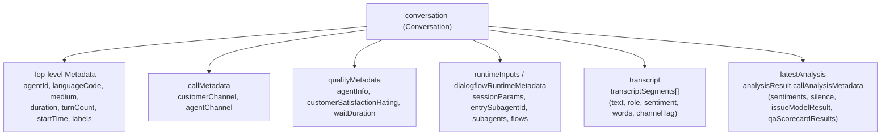

# Contact Center AI Insights CEL Cookbook & Reference Guide

This document is a comprehensive reference for authoring Common Expression Language (CEL) rules for Google Cloud Contact Center AI (CCAI) Insights Autolabeling Rules.

______________________________________________________________________

## 1. Overview & Evaluation Semantics

Autolabeling rules evaluate incoming conversations in real-time or during batch ingestion.

- **Evaluation Order**: Conditions are evaluated sequentially from top to bottom (first-match-wins).
- **Fallback Rules**: The last condition should always have an empty condition `condition: ""` to act as the default fallback tag.
- **String Literals**: Values in CEL expressions or return values should be properly quoted (e.g. `'vip_tier'`, `"support"`).
- **Return Value**: The matched `value` expression is assigned to the conversation's `labels[label_key]`.
- **Field Naming Convention**: In CEL expressions, all protobuf fields are accessed using **camelCase** identifiers.

______________________________________________________________________

## 2. Conversation Resource Schema (`resources.proto`)

In CEL expressions, the root `conversation` variable provides direct access to the `google.cloud.contactcenterinsights.v1.Conversation` object. All field identifiers are in **camelCase**.



### 2.1 Top-Level Attributes

| Field Path                  | Type                  | Description                                                   | CEL Example                                                              |
| --------------------------- | --------------------- | ------------------------------------------------------------- | ------------------------------------------------------------------------ |
| `conversation.name`         | `string`              | Full resource name (`projects/*/locations/*/conversations/*`) | `conversation.name.endsWith('/conv123')`                                 |
| `conversation.agentId`      | `string`              | Identifier of virtual agent / CXAS app / bot                  | `conversation.agentId == 'billing_bot'`                                  |
| `conversation.languageCode` | `string`              | BCP-47 language tag                                           | `conversation.languageCode == 'es-US'`                                   |
| `conversation.medium`       | `enum` / `int`        | `1` (PHONE_CALL), `2` (CHAT), `0` (UNSPECIFIED)               | `conversation.medium == 1`                                               |
| `conversation.duration`     | `duration` / `int`    | Total interaction duration (seconds)                          | `conversation.duration > 300`                                            |
| `conversation.turnCount`    | `int`                 | Total number of conversational turns                          | `conversation.turnCount >= 10`                                           |
| `conversation.startTime`    | `timestamp`           | Start timestamp of interaction                                | `conversation.startTime > timestamp('2026-01-01T00:00:00Z')`             |
| `conversation.labels`       | `map[string, string]` | Key-value labels attached to conversation                     | `'tier' in conversation.labels && conversation.labels['tier'] == 'gold'` |

______________________________________________________________________

### 2.2 Call & Quality Metadata (`callMetadata`, `qualityMetadata`)

Defined by `message CallMetadata` and `message QualityMetadata`:

| Field Path                                                | Type              | Description                                         | CEL Example                                                                 |
| --------------------------------------------------------- | ----------------- | --------------------------------------------------- | --------------------------------------------------------------------------- |
| `conversation.callMetadata.customerChannel`               | `int`             | Audio channel tag for customer (typically 1 or 2)   | `conversation.callMetadata.customerChannel == 1`                            |
| `conversation.callMetadata.agentChannel`                  | `int`             | Audio channel tag for agent                         | `conversation.callMetadata.agentChannel == 2`                               |
| `conversation.qualityMetadata.customerSatisfactionRating` | `int`             | Customer satisfaction rating (CSAT score, e.g. 1-5) | `conversation.qualityMetadata.customerSatisfactionRating <= 2`              |
| `conversation.qualityMetadata.waitDuration`               | `duration`        | Time spent waiting in queue before agent answered   | `conversation.qualityMetadata.waitDuration > 120`                           |
| `conversation.qualityMetadata.menuPath`                   | `string`          | IVR menu path traversed by caller                   | `conversation.qualityMetadata.menuPath.contains('Billing')`                 |
| `conversation.qualityMetadata.agentInfo`                  | `list[AgentInfo]` | List of human or virtual agents handling the call   | `conversation.qualityMetadata.agentInfo.exists(a, a.team == 'escalations')` |

Each `AgentInfo` contains:

- `agentId`: `string`
- `displayName`: `string`
- `team`: `string`
- `teams`: `list[string]`

______________________________________________________________________

### 2.3 Runtime Session Parameters & Dialogflow Metadata

Defined by `runtimeInputs` and `dialogflowRuntimeMetadata`:

| Field Path                                               | Type                  | Description                                             | CEL Example                                                               |
| -------------------------------------------------------- | --------------------- | ------------------------------------------------------- | ------------------------------------------------------------------------- |
| `conversation.runtimeInputs.sessionParams`               | `map[string, string]` | Dynamic session parameters from CXAS/Dialogflow session | `conversation.runtimeInputs.sessionParams['auth_status'] == 'verified'`   |
| `conversation.dialogflowRuntimeMetadata.entrySubagentId` | `string`              | First sub-agent entered during interaction              | `conversation.dialogflowRuntimeMetadata.entrySubagentId == 'onboarding'`  |
| `conversation.dialogflowRuntimeMetadata.subagents`       | `list[string]`        | All sub-agents visited during the conversation          | `conversation.dialogflowRuntimeMetadata.subagents.contains('payment_v2')` |
| `conversation.dialogflowRuntimeMetadata.flows`           | `list[string]`        | All flows executed                                      | `conversation.dialogflowRuntimeMetadata.flows.contains('refund_flow')`    |

______________________________________________________________________

### 2.4 Transcripts & Turn Segments (`transcript.transcriptSegments`)

Defined by `message Transcript` and `message TranscriptSegment`:

| Field Path                                   | Type                      | Description                                              | CEL Example                                              |
| -------------------------------------------- | ------------------------- | -------------------------------------------------------- | -------------------------------------------------------- |
| `conversation.transcript.transcriptSegments` | `list[TranscriptSegment]` | Ordered sequence of conversation turns                   | `conversation.transcript.transcriptSegments.size() > 15` |
| `segment.text`                               | `string`                  | Transcribed text spoken/typed in turn                    | `segment.text.contains('cancel my account')`             |
| `segment.confidence`                         | `float`                   | ASR speech-to-text confidence score (0.0 to 1.0)         | `segment.confidence < 0.7`                               |
| `segment.channelTag`                         | `int`                     | Channel index (1 or 2)                                   | `segment.channelTag == 1`                                |
| `segment.participant.role`                   | `enum` / `int`            | `1` (HUMAN_AGENT), `2` (AUTOMATED_AGENT), `3` (END_USER) | `segment.participant.role == 3`                          |
| `segment.participant.userId`                 | `string`                  | Unique identifier for the participant                    | `segment.participant.userId != ''`                       |
| `segment.sentiment.score`                    | `float`                   | Sentiment score (-1.0 to +1.0)                           | `segment.sentiment.score < -0.5`                         |
| `segment.sentiment.magnitude`                | `float`                   | Sentiment strength / magnitude (0.0 to +inf)             | `segment.sentiment.magnitude > 2.0`                      |

#### Transcript Segment Traversal Examples:

```cel
// Check if user uttered specific cancellation keywords
conversation.transcript.transcriptSegments.exists(
  s, s.participant.role == 3 && (s.text.contains('cancel') || s.text.contains('close account'))
)
```

```cel
// Check if customer had deeply negative sentiment on any turn
conversation.transcript.transcriptSegments.exists(
  s, s.participant.role == 3 && s.sentiment.score < -0.6
)
```

______________________________________________________________________

### 2.5 Analysis Results & QA Scorecards (`latestAnalysis.analysisResult`)

Defined by `message Analysis`, `message AnalysisResult`, and `message CallAnalysisMetadata`:

| Field Path                                                                                  | Type                               | Description                                               | CEL Example                                                                                                                               |
| ------------------------------------------------------------------------------------------- | ---------------------------------- | --------------------------------------------------------- | ----------------------------------------------------------------------------------------------------------------------------------------- |
| `conversation.latestAnalysis.analysisResult.callAnalysisMetadata.sentiments`                | `list[ConversationLevelSentiment]` | Channel-level aggregated sentiment scores                 | `conversation.latestAnalysis.analysisResult.callAnalysisMetadata.sentiments.exists(s, s.channelTag == 1 && s.sentimentData.score < -0.3)` |
| `conversation.latestAnalysis.analysisResult.callAnalysisMetadata.silence.silencePercentage` | `float`                            | Percentage of interaction spent in silence (0.0 to 100.0) | `conversation.latestAnalysis.analysisResult.callAnalysisMetadata.silence.silencePercentage > 25.0`                                        |
| `conversation.latestAnalysis.analysisResult.callAnalysisMetadata.silence.silenceDuration`   | `duration`                         | Total silence duration                                    | `conversation.latestAnalysis.analysisResult.callAnalysisMetadata.silence.silenceDuration > 60`                                            |
| `conversation.latestAnalysis.analysisResult.callAnalysisMetadata.issueModelResult.issues`   | `list[IssueAssignment]`            | Topics assigned by Topic Models                           | `conversation.latestAnalysis.analysisResult.callAnalysisMetadata.issueModelResult.issues.exists(i, i.displayName == 'Billing Dispute')`   |
| `conversation.latestAnalysis.analysisResult.callAnalysisMetadata.phraseMatchers`            | `map[string, PhraseMatchData]`     | Phrase matchers triggered                                 | `'competitor_mention' in conversation.latestAnalysis.analysisResult.callAnalysisMetadata.phraseMatchers`                                  |
| `conversation.latestAnalysis.analysisResult.callAnalysisMetadata.qaScorecardResults`        | `list[QaScorecardResult]`          | Evaluation scorecard scores and question answers          | `conversation.latestAnalysis.analysisResult.callAnalysisMetadata.qaScorecardResults.exists(q, q.normalizedScore < 70.0)`                  |

______________________________________________________________________

## 3. Built-in CCAI Helper Functions

CCAI Insights provides specialized helper functions that simplify inspecting transcripts, session parameters, and annotators:

### 3.1 Sub-Agent / Flow Traversal

Checks whether a specific GECX/CXAS sub-agent or Dialogflow flow participated in the conversation:

```cel
containsSubAgent(conversation, "billing_specialist")
```

```cel
containsSubAgent(conversation, "order_lookup_flow")
```

### 3.2 Session Parameters & Context

Inspects session parameters captured during the interaction (from webhook responses or tool executions):

```cel
hasSessionParam(conversation, "authenticated", "true")
```

```cel
hasSessionParam(conversation, "membership_tier", "platinum")
```

### 3.3 Sentiment Analysis

Checks participant sentiment level:

```cel
// Customer sentiment is negative
hasCallerSentiment(conversation, "NEGATIVE")
```

```cel
// Agent sentiment is positive
hasAgentSentiment(conversation, "POSITIVE")
```

### 3.4 Entity & Intent Matching

Checks if specific entity types or intents were detected:

```cel
hasEntity(conversation, "CREDIT_CARD_DISPUTE")
```

```cel
hasIntent(conversation, "cancel_subscription")
```

______________________________________________________________________

## 4. Common Recipes & Complete YAML Examples

### Recipe 1: Sub-Agent Routing & Containment

Classifies conversation category based on the sub-agents traversed during the session.

```yaml
- rule_id: "agent_domain"
  display_name: "Agent Domain Classifier"
  label_key: "agent_domain"
  label_key_type: "LABEL_KEY_TYPE_CUSTOM"
  active: true
  conditions:
    - condition: "containsSubAgent(conversation, 'billing_specialist') || containsSubAgent(conversation, 'invoice_lookup')"
      value: "'billing'"
    - condition: "containsSubAgent(conversation, 'tech_support') || containsSubAgent(conversation, 'troubleshooting')"
      value: "'tech_support'"
    - condition: "containsSubAgent(conversation, 'sales_inquiry')"
      value: "'sales'"
    - condition: ""
      value: "'general_inquiry'"
```

______________________________________________________________________

### Recipe 2: Customer Frustration & Escalation Risk

Flags conversations that exhibited negative caller sentiment, high turn count, or poor scorecard score.

```yaml
- rule_id: "escalation_risk"
  display_name: "Escalation Risk Detector"
  label_key: "escalation_risk"
  active: true
  conditions:
    - condition: "hasCallerSentiment(conversation, 'NEGATIVE') && (conversation.turnCount > 12 || conversation.duration > 400)"
      value: "'high_risk'"
    - condition: "hasCallerSentiment(conversation, 'NEGATIVE') || conversation.turnCount > 15"
      value: "'medium_risk'"
    - condition: ""
      value: "'low_risk'"
```

______________________________________________________________________

### Recipe 3: User Authentication Status

Tags whether the caller completed two-factor or PIN authentication during their journey.

```yaml
- rule_id: "auth_status"
  display_name: "User Authentication Status"
  label_key: "auth_status"
  active: true
  conditions:
    - condition: "hasSessionParam(conversation, 'auth_level', '2fa_verified')"
      value: "'authenticated_2fa'"
    - condition: "hasSessionParam(conversation, 'auth_level', 'pin_verified')"
      value: "'authenticated_pin'"
    - condition: "hasSessionParam(conversation, 'auth_attempted', 'true')"
      value: "'auth_failed'"
    - condition: ""
      value: "'unauthenticated'"
```

______________________________________________________________________

### Recipe 4: Interaction Complexity (Duration & Silence)

Buckets sessions by duration and excessive dead air/silence.

```yaml
- rule_id: "interaction_complexity"
  display_name: "Interaction Complexity Tier"
  label_key: "complexity"
  active: true
  conditions:
    - condition: "conversation.duration > 600 || conversation.turnCount > 20 || conversation.latestAnalysis.analysisResult.callAnalysisMetadata.silence.silencePercentage > 30.0"
      value: "'very_complex'"
    - condition: "conversation.duration > 240 || conversation.turnCount > 8"
      value: "'moderate'"
    - condition: ""
      value: "'simple_quick'"
```

______________________________________________________________________

## 5. Authoring Best Practices

1. **camelCase Identifiers**: Always use camelCase for protobuf message fields (e.g. `conversation.agentId`, `conversation.turnCount`, `conversation.startTime`, `conversation.qualityMetadata.waitDuration`).
1. **Explicit Fallback**: Always ensure the final condition in every rule is `condition: ""` to guarantee deterministic labeling.
1. **Quoted Values**: Ensure all string literal values in the `value` field are quoted (e.g. `'billing'` instead of `billing`).
1. **List Quantifiers**: Use `.exists(...)` or `.all(...)` when checking elements within repeated fields such as `transcript.transcriptSegments` or `qaScorecardResults`.
1. **Test via Dry-Run**: Always review diffs before deploying (`cxas insights diff-autolabel-rules` or `push-autolabel-rules --dry-run`).
