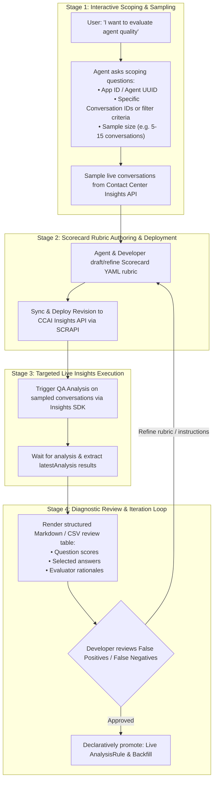

# CXAS Insights Interactive Scorecard & Evaluation Skill

This skill guides AI coding assistants (like Jetski) in pair-programming with developers on Google Cloud Contact Center Insights (CCAI / GECX / CXAS Insights).

---

## The 4-Stage Human-in-the-Loop Workflow



---

## Step-by-Step Instructions for Agents

### Stage 1: Interactive Scoping & Conversation Discovery

When the user wants to evaluate or monitor conversations, do NOT guess their data. Use the interactive questioning tool (`ask_question`) to clarify:
1. **Target Agent**: The GCP Project ID, location (e.g. `us`, `us-central1`), and App ID / Agent UUID.
2. **Conversation Source**:
   - Do they have a specific list of Conversation IDs?
   - Or do they want to sample recent live conversations from Insights matching `agent_id = "<uuid>"`?
3. **Sample Size**: Suggest a practical sample (e.g., 5–15 conversations) for quick rubric iteration.

**Sampling Script**:
```bash
python .agents/skills/cxas-insights/scripts/sample_conversations.py \
  --project-id <PROJECT_ID> \
  --location <LOCATION> \
  --filter 'agent_id = "<AGENT_UUID>"' \
  --limit 10 \
  --output sampled_conversations.json
```

---

### Stage 2: Scorecard Rubric Authoring

Collaborate with the user to draft or customize a scorecard template in YAML (see [`references/scorecard-template-guide.md`](references/scorecard-template-guide.md)):

```yaml
qaScorecard:
  displayName: "Conversational Agent Quality"
  description: "Evaluates agent comprehension, tone, accuracy, and task resolution."

qaQuestions:
  - questionBody: "Did the agent correctly comprehend and address the customer's intent?"
    abbreviation: "intent_understanding"
    answerChoices:
      - key: "yes"
        body: "Agent understood user request."
        score: 1.0
      - key: "no"
        body: "Agent misunderstood or gave unrelated response."
        score: 0.0
    answerInstructions: |
      Check if the agent's response directly addressed what the user asked.
```

---

### Stage 3: Targeted Live Insights Execution

Execute the draft scorecard directly against the sampled conversations in Contact Center Insights:

```bash
python .agents/skills/cxas-insights/scripts/test_scorecard_live.py \
  --project-id <PROJECT_ID> \
  --location <LOCATION> \
  --template scorecard.yaml \
  --conversations-file sampled_conversations.json \
  --output eval_results.md
```

---

### Stage 4: Diagnostic Review & Iteration Loop

1. Present the evaluated scorecard results in a structured markdown table for the user to eyeball:
   - Conversation ID
   - Question Body / Abbreviation
   - Selected Answer & Score
   - Evaluator Rationale (why the model picked this answer)
2. Ask the user for feedback:
   - *"Did you notice any false positives or false negatives in the evaluation?"*
   - *"Would you like to refine the answerInstructions for any question and re-run?"*
3. Once the user is satisfied, promote the scorecard to production using declarative reconciliation:
   ```bash
   python .agents/skills/cxas-insights/scripts/reconcile_insights.py --apply --config insights_config.yaml
   ```

---

## Reference Guides
- [`references/declarative-spec.md`](references/declarative-spec.md): Schema guide for `insights_config.yaml`.
- [`references/prompt-engineering-guide.md`](references/prompt-engineering-guide.md): Best practices for writing robust scorecard rubrics.
- [`references/scorecard-template-guide.md`](references/scorecard-template-guide.md): Scorecard JSON/YAML format guide.
