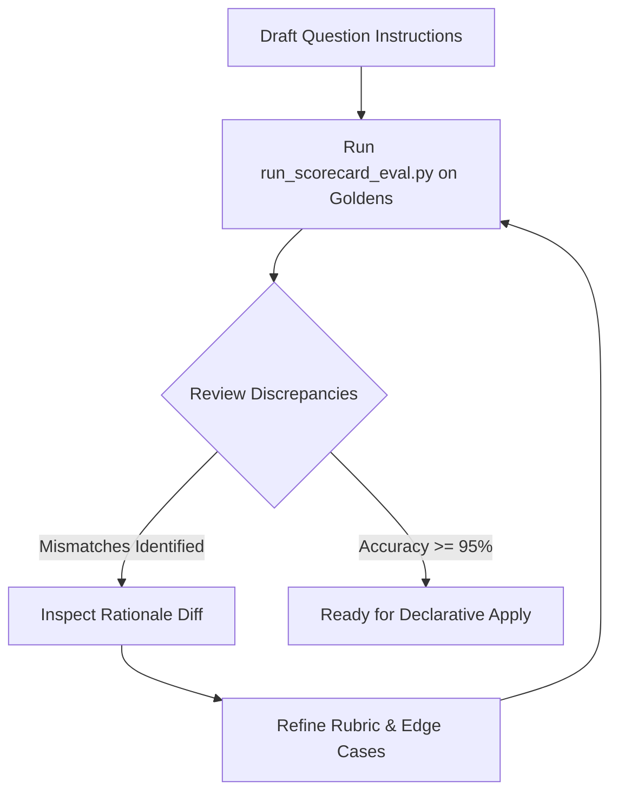

# Scorecard Prompt Engineering & Rubric Tuning Guide

This guide details best practices for prompt authors, evaluators, and LLM agents authoring scorecard questions and `answerInstructions` in Google Cloud Contact Center Insights.

---

## Structure of a Scorecard Question

In CCAI Insights, each scorecard question consists of:
1. **`questionBody`**: The high-level question being asked (e.g. *"Did the agent authenticate the caller before providing account details?"*).
2. **`answerChoices`**: Mutually exclusive outcomes (e.g., `yes`, `no`, `na`), each with an optional numeric score and description.
3. **`answerInstructions`**: The detailed evaluation prompt / rubric that instructs the LLM evaluator on exact criteria, edge cases, and exceptions.

---

## Best Practices for Writing `answerInstructions`

### 1. Be Explicit About Criteria
Avoid ambiguous terms like *"Evaluate if the agent was good"*. Instead, enumerate concrete behavioral indicators:
- ✅ *Good*: *"The agent must explicitly state the policy cancellation fee and confirm the user acknowledged it before processing the cancellation."*
- ❌ *Bad*: *"Make sure the customer understood everything."*

### 2. Define Boundary and Edge Cases
Specify what should happen when:
- The customer brings up the topic first.
- The conversation was abruptly dropped or transferred.
- The question is Not Applicable (`na`).

**Example Template**:
```yaml
answerInstructions: |
  Evaluate whether the agent offered relevant self-service options.
  - Choose 'yes' if the agent mentioned the mobile app, online portal, or SMS link.
  - Choose 'no' if the agent resolved the issue manually without mentioning digital channels when digital channels were applicable.
  - Choose 'na' if the user specifically stated they do not have smartphone/internet access or if the query required strict in-person verification.
```

### 3. Require Specific Evidence in Rationales
Instruct the model to cite speaker turns or quotes:
```yaml
answerInstructions: |
  Check if the agent verified two factors of authentication (e.g. PIN, mother's maiden name, OTP).
  Cite the exact turn numbers where authentication was requested and confirmed in your rationale.
```

---

## Iterative Tuning Loop with `run_scorecard_eval.py`



1. **Start with 10-20 Golden Transcripts**: Include diverse cases (ideal conversations, edge cases, escalations, partial answers).
2. **Run Local Evaluation**:
   ```bash
   python .agents/skills/cxas-insights/scripts/run_scorecard_eval.py \
     --template scorecards/my_scorecard.yaml \
     --goldens golden_dataset.json \
     --output eval_report.json
   ```
3. **Analyze Discrepancies**:
   - If the model chose `no` instead of `yes`, did the model overlook a subtle phrasing? Add synonyms or acceptable phrasing to `answerInstructions`.
   - If the model chose `yes` instead of `no`, was the rubric too lenient? Add negative examples or stricter conditions.
