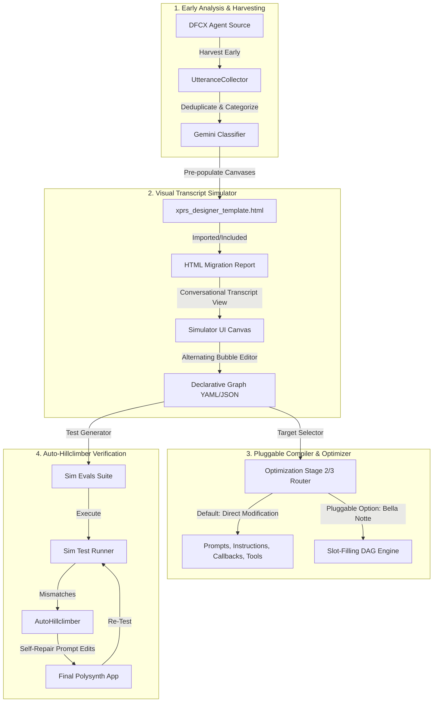
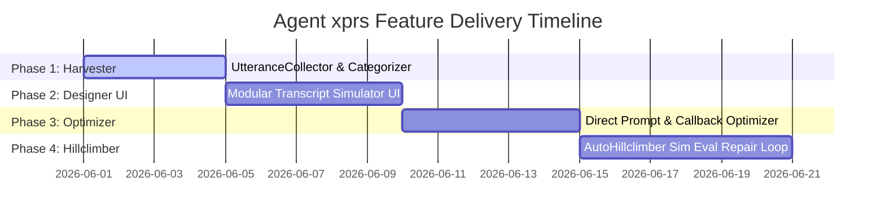

# Implementation Plan: Agent xprs (express)
## **Interactive Agentic Design Through Direct Conversational Graphs**

This document presents the comprehensive technical specification and implementation plan for **Agent xprs (express)**—a conversational designer that empowers builders to visually define, optimize, and programmatically enforce conversational journeys within migrated Polysynth/CXAS agents.

---

## 1. Architectural Overview

`Agent xprs` bridges legacy Dialogflow CX (DFCX) state machines and generative, LLM-driven Polysynth apps by allowing builders to design conversational journeys using a **conversational transcript simulator UI**. The visual transcript is compiled into a **declarative graph schema** (YAML), which by default drives direct prompt/instruction and callback optimization (Stage 2/3), or optionally compiles into a **pluggable slot-filling DAG engine (Bella Notte)**.



---

## 2. Core Components

### 2.1 Early Utterance Harvester & Categorizer (`UtteranceCollector`)
A Python service executed **immediately** after the source DFCX agent details are loaded and tree views are synthesized, *before* the main migration and optimization stages begin. This enables early visual canvas pre-filling, allowing users to design conversational graphs while the background migration runs in parallel.

- **Location**: `src/cxas_scrapi/migration/utterance_collector.py`
- **Harvesting Targets**:
  - **DFCX Flows & Pages**: Scrapes `Say:` prompts, event handlers (`sys.no-match`, `sys.no-input`), and conditional transition routes.
  - **DFCX Playbooks**: Analyzes instruction texts to extract canned prompt sentences.
  - **DFCX Code Blocks**: Traverses Python AST structures to extract string literals printed or returned to the user.
- **Deduplication & Classification**:
  - Categorizes utterances into: `greeting`, `authentication`, `re_prompt`, `general_logic`, `general_guardrails`, `goodbye`, `no_match_no_input`.
  - Uses high-speed rule matching first, followed by a single parallelized Gemini pass (`gemini-3.5-flash-preview`) for semantic classification and deduplication.

### 2.2 Modular Transcript Simulator UI (`Agent xprs Designer`)
The conversational designer is implemented as a self-contained, modular HTML template injected into the main report template.

- **Location**: `src/cxas_scrapi/migration/xprs_designer_template.html` (injected into `analysis_report_template.html` via Jinja2 ``).
- **UI Layout**:
  - **Left Rail (Canvas Mini-map & Selector)**: Shows tiles for active Critical User Journeys (CUJs): *Core CUJ*, *No Input*, *Attack Guardrails*, *Unrelated Queries*. Allows adding/renaming canvases.
  - **Center Canvas (Conversational Transcript Simulator)**: A chat-style simulator displaying alternating agent and user bubbles.
    - **No Visual Graph Edges**: The UI completely hides graph connection lines to make design clean, natural, and accessible. Turns are implicitly connected sequentially.
    - **Alternating Bubbles**: Conversation bubbles are editable (inline text editing), re-arrangeable (drag-and-drop reordering), and togglable.
    - **Toggle Switch**: Each bubble has an inline toggle:
      - **Verbatim**: Enforce exact matching (canned response for Agent, expected exact phrase for User; represented by a `100%` badge).
      - **Generative**: Natural language flexibility (instructions/guidelines for Agent, intent/description for User; represented by a `Gemini Sparkle` badge).
  - **Right Rail (Utterance Palette)**: Shows the categorized, harvested utterances. Users can search, filter, and drag/click them to append to the active transcript canvas.
- **Synchronization Server**:
  - When the user clicks **"Save & Apply"**, the client makes a POST request to a local lightweight REST endpoint spun up temporarily by `MigrationService` (e.g., `http://localhost:8080/save_xprs`).
  - **Fallback**: If the server is unreachable, the UI displays a modal allowing the user to copy the compiled YAML string or download it directly as `agent_xprs_config.yaml`.

### 2.3 Declarative Conversational Graph Schema
The visual transcript compiles into a clean, standardized YAML configuration. The sequential bubbles are translated into direct nodes and transitions internally.

```yaml
canvases:
  - name: "party_size_booking"
    category: "Core CUJ"
    nodes:
      - id: "node_1"
        type: "agent"
        mode: "verbatim"
        content: "Welcome to Bella Notte! I'd be happy to help you with a reservation."
        transitions:
          - next: "node_2"
      - id: "node_2"
        type: "user"
        mode: "generative"
        content: "User specifies party size"
        transitions:
          - next: "node_3"
```

---

## 3. Pluggable Compilation & Optimization

To ensure that the designed conversations flow exactly as specified, the declarative config is compiled and applied in **Optimization Stage 2** (or a new Stage). We support two distinct compiler targets:

### 3.1 Default Target: Direct Prompt & Callback Optimization (Direct Stage)
The default compilation path operates by directly updating standard Polysynth agent configurations with minimal, high-impact edits:
1. **Instructions/Prompts**: Synthesizes specific prompt XML `<state>` nodes and direct rules matching the transcript turns. Verbatim responses are injected as strict text directives (e.g., `Greet the user exactly verbatim with: "..."`).
2. **Callbacks**: Updates or auto-generates `before_model_callback` functions to inspect session variables, compare state, and programmatically return canned verbatim responses when exact conversation milestones are hit.
3. **Variables & Tools**: Binds parameter mapping and registers setter tools dynamically.

### 3.2 Pluggable Target: Bella Notte DAG Slot-Filling Engine
An optional, pluggable compiler destination converts the designed canvases into the deterministic **Bella Notte Slot-Filling DAG Engine**:
- **Verbatim Agent Nodes** map to slot-definitions with `source: announce` and a predefined `message` and `response` payload.
- **Generative Agent Nodes** map to slot-definitions with `source: user` and a customized `system_directive`.
- **User Nodes** map to slot-definitions with NLU validation guidelines or parameter setters.
- **Transitions** map to slot preconditions (`requires`, `condition`).
The compiler produces the `{config_id}_dag` Python tool dictionary and registers the generic before-model callback orchestrator.

---

## 4. AutoHillclimber Eval Verification Loop

Once the Polysynth app is fully deployed, we verify compliance under real-world test simulations.

- **Location**: `src/cxas_scrapi/migration/auto_hillclimber.py`
- **Orchestration Lifecycle**:
  1. **Test Case Synthesis**: Translates designed canvases into multi-turn Golden Transcript test suites in Polysynth `sim-eval` format.
  2. **Execution**: Runs simulation turns against the live deployed Polysynth app.
  3. **Mismatch Isolation**: Extracts the conversational trace if a turn deviates from the verbatim guidelines or target transitions.
  4. **Self-Repair Pass**: Invokes Gemini to make surgical prompt instruction edits or callback validation adjustments with minimal changes until all test cases pass.

---

## 5. Implementation Timeline & Phase Breakdown

We propose completing this major feature in 4 contiguous phases:



### Phase 1: Utterance Harvester & Categorizer (Days 1–4)
- [ ] Create `src/cxas_scrapi/migration/utterance_collector.py` implementing the `UtteranceCollector` class.
- [ ] Integrate harvester execution in `MigrationService.run_migration` immediately after `self.source_agent_data` is loaded.
- [ ] Implement rule-based and Gemini-based classification.
- [ ] Write comprehensive unit tests in `tests/cxas_scrapi/migration/test_utterance_collector.py`.

### Phase 2: Modular Transcript Simulator UI (Days 5–9)
- [ ] Create `src/cxas_scrapi/migration/xprs_designer_template.html` as a modular, included HTML component.
- [ ] Inject the modular template into `src/cxas_scrapi/migration/analysis_report_template.html` using ``.
- [ ] Implement visual transcript simulator canvas with alternating agent/user bubbles, reordering, text edits, and Verbatim/Generative toggling (visual edges completely hidden).
- [ ] Implement lightweight REST Server in `MigrationService` to sync the visual design config.

### Phase 3: Direct Prompt & Callback Optimizer (Days 10–14)
- [ ] Implement the Direct Prompt Compiler translating YAML transcript nodes into XML state prompts and callbacks.
- [ ] Implement the pluggable Bella Notte Compiler as an optional compilation destination.
- [ ] Update Stage 2 Optimization in `src/cxas_scrapi/migration/optimizer.py` to execute direct prompt/callback patches or DAG compilations based on config.
- [ ] Verify direct optimization with local integration tests.

### Phase 4: AutoHillclimber Sim-Eval Verification (Days 15–20)
- [ ] Create `src/cxas_scrapi/migration/auto_hillclimber.py`.
- [ ] Set up the simulation runner that converts visual transcripts to test golden files.
- [ ] Develop the self-repair loop that compiles minimal prompt updates using Gemini.
- [ ] Verify complete success against test suites.

---

> [!IMPORTANT]
> We will strictly ensure that:
> 1. **All existing logic** in the migration service remains intact without regressions.
> 2. **No code changes or file modifications** will be executed until you review this plan and provide explicit authorization.
> 3. All code complies with internal secure web standards and best practices.
