# High-Level Architectural Migration Plan: Click CLI for cxas-scrapi (Iteration 3 - Final)

## 1. Overview & Objectives
This plan details the migration of `cxas-scrapi` command line interface (`src/cxas_scrapi/cli/`) from standard Python `argparse` to `click>=8.1.0`. The refactoring builds upon the existing handler modularization across `evals.py`, `deployments.py`, `conversations.py`, `sessions.py`, `migration_cli.py`, `trace_cli.py`, `insights_cli.py`, and `resources_cli.py`.

### Primary Goals:
1. **Zero CLI Breaking Changes**: Maintain exact command syntax, argument naming, and flag options for all users and CI scripts (`cxas run`, `cxas tools list`, `cxas trace search`, `cxas migrate dfcx --optimize --stage 1`).
2. **Compliance with `AGENTS.md` Mandates**:
   - Guarantee `cxas help <subcommand>` dynamic help inspection via recursive child context instantiation (`parent_ctx`).
   - Guarantee `cxas lint` structural checks (`--app-dir`, `--fix`, `--only`, etc.).
   - Guarantee `cxas llm-lint --agent-dir <dir>` semantic prompt linting.
   - Guarantee `cxas trace search <query>` search syntax and flags (`--match {phrase,all,any}`, `--snippets`, `--format table/json/csv`).
3. **Test Stability via Bridge Pattern & Protocol Typing**: Preserve all 150 passing unit tests across `tests/cxas_scrapi/cli/` using a centralized `to_namespace(ctx, **kwargs)` bridge helper backed by `typing.Protocol` contracts (`EvalRunProtocol`, `TraceSearchProtocol`).
4. **Performance & Eager Loading Prevention**: Implement lazy command registration (`click.MultiCommand` or lazy submodule lookup) in `main.py` to prevent multi-hundred millisecond startup penalties when invoking `cxas --help` or `cxas lint`.
5. **Python Invariants Compliance**: Enforce PEP 585 (`dict`, `list`, `tuple`) and PEP 604 (`|` unions), structured docstrings (`Args:`, `Returns:`), and avoid complex tuples (`>2` elements).
6. **Execution Mandate**: Always execute commands using `uv run cxas` and tests using `uv run pytest`.

---

## 2. Target CLI Architecture & Exact Command Tree

```mermaid
graph TD
    Root[cxas cli group] --> Push[push]
    Root --> Pull[pull]
    Root --> Lint[lint]
    Root --> LlmLint[llm-lint]
    Root --> Session[run-session]
    Root --> Help[help]
    Root --> Init[init]
    Root --> Branch[branch]
    Root --> Delete[delete]
    Root --> CreateRemote[create]
    Root --> RunTop[run]
    Root --> CiTest[ci-test]
    Root --> LocalTest[local-test]
    Root --> ExportTop[export]
    Root --> PushEvalTop[push-eval]
    Root --> TestTools[test-tools]
    Root --> TestCallbacks[test-callbacks]
    Root --> TestSingleCallback[test-single-callback]
    Root --> InitGhAction[init-github-action]
    
    Root --> Apps[apps group]
    Apps --> AppsList[list]
    Apps --> AppsGet[get]
    
    Root --> LocalGroup[local group]
    LocalGroup --> LocalCreate[create: agent / tool / guardrail]
    
    Root --> Evals[evals group]
    Evals --> EvalsReport[report]
    
    Root --> Deployments[deployments group]
    Deployments --> DepsList[list]
    Deployments --> DepsCreate[create]
    Deployments --> DepsPromote[promote]
    
    Root --> Conversations[conversations group]
    Conversations --> ConvList[list]
    Conversations --> ConvGet[get]
    
    Root --> ToolsGroup[tools group]
    ToolsGroup --> ToolsList[list]
    ToolsGroup --> ToolsDelete[delete]
    
    Root --> CallbacksGroup[callbacks group]
    CallbacksGroup --> CallbacksList[list]
    CallbacksGroup --> CallbacksDelete[delete]
    
    Root --> VariablesGroup[variables group]
    VariablesGroup --> VarsList[list]
    VariablesGroup --> VarsDelete[delete]
    
    Root --> Trace[trace group]
    Trace --> TraceSearch[search]
    Trace --> TraceList[list]
    Trace --> TraceGet[get]
    Trace --> TraceLogs[logs]
    Trace --> TraceAudio[audio]
    Trace --> TraceTriage[triage]
    Trace --> TraceReplay[replay]
    Trace --> TraceStats[stats]
    Trace --> TraceBundle[bundle]
    Trace --> TraceBug[bug-report]
    Trace --> TraceOpen[open]
    
    Root --> Insights[insights group]
    Insights --> InsList[list]
    Insights --> InsExport[export]
    Insights --> InsImport[import]
    Insights --> InsCopy[copy]
    Insights --> InsScorecards[create-scorecard / activate / deploy / validate / smoke-test]
    Insights --> InsTopicModels[list / create / deploy / undeploy / get / topics]
    Insights --> InsRules[list / create / activate / get / delete]
    Insights --> InsMetrics[analyze-metrics]
    
    Root --> Migrate[migrate group]
    Migrate --> MigDfcx[dfcx: --optimize --stage 1/2/3/resume]
    
    Root --> Versions[versions group]
    Versions --> VerList[list]
    Versions --> VerCompare[compare]
```



---

## 3. Root Context & Centralized Bridge Helper (`to_namespace`)

### Root Command & Context Storage (`src/cxas_scrapi/cli/main.py`)
```python
import os
from typing import Any
import click

@click.group(name="cxas", context_settings=dict(help_option_names=["-h", "--help"]))
@click.option("--oauth-token", help="OAuth token string for CES API authentication.")
@click.option("--no-input", is_flag=True, help="Disable interactive prompts in CI/CD pipelines.")
@click.pass_context
def cli(ctx: click.Context, oauth_token: str | None, no_input: bool) -> None:
    """Root CLI group entrypoint for cxas-scrapi.

    Args:
        ctx: Click execution context for storing root parameters.
        oauth_token: Optional OAuth bearer token override.
        no_input: Flag to suppress interactive terminal input.
    Returns:
        None
    """
    if oauth_token:
        os.environ["CXAS_OAUTH_TOKEN"] = oauth_token
    ctx.ensure_object(dict)
    ctx.obj["no_input"] = no_input
    ctx.obj["oauth_token"] = oauth_token
```

### Centralized Namespace Conversion Helper (`src/cxas_scrapi/cli/utils.py`)
```python
from types import SimpleNamespace
from typing import Any, Callable
import click

def to_namespace(ctx: click.Context, **kwargs: Any) -> SimpleNamespace:
    """Merges root parameters with kwargs and normalizes trailing underscores to attributes.

    Args:
        ctx: Click execution context.
        kwargs: Parsed options and arguments for the subcommand.
    Returns:
        SimpleNamespace: Populated namespace object with root fallbacks.
    """
    root_params = {"no_input": False, "oauth_token": None} | (ctx.find_root().obj or {})
    merged = root_params | kwargs
    # Normalize trailing underscores used to avoid Python builtin shadowing
    clean_kwargs: dict[str, Any] = {}
    for key, val in merged.items():
        clean_key = key[:-1] if key.endswith("_") and len(key) > 1 else key
        clean_kwargs[clean_key] = val
    return SimpleNamespace(**clean_kwargs)

def project_location_options(required: bool = True) -> Callable[[Callable[..., Any]], Callable[..., Any]]:
    """Parameterized decorator adding project-id and location flags to commands.

    Args:
        required: Whether the project and location flags are required.
    Returns:
        Callable: The decorated Click command function.
    """
    def decorator(func: Callable[..., Any]) -> Callable[..., Any]:
        func = click.option("--project-id", "-p", envvar="GCP_PROJECT_ID", required=required, help="GCP project ID.")(func)
        func = click.option("--location", "-l", envvar="GCP_REGION", required=required, help="GCP location.")(func)
        return func
    return decorator

def app_name_option(required: bool = True) -> Callable[[Callable[..., Any]], Callable[..., Any]]:
    """Parameterized decorator adding app-name flag to commands.

    Args:
        required: Whether the app-name flag is required.
    Returns:
        Callable: The decorated Click command function.
    """
    def decorator(func: Callable[..., Any]) -> Callable[..., Any]:
        return click.option("--app-name", "-a", envvar="GECX_APP_NAME", required=required, help="App resource name.")(func)
    return decorator
```

### Exact Linter Bridge Specifications (`app.py` & `llm_lint.py`)
```python
@click.command(name="lint")
@click.option("--app-dir", default=".", help="Path to app directory.")
@click.option("--fix", is_flag=True, help="Automatically apply safe linter fixes.")
@click.option("--only", type=click.Choice(["instructions", "callbacks", "tools", "evals", "config", "structure", "schema"]), help="Run only specific rule categories.")
@click.option("--rule", help="Run a specific rule by ID.")
@click.option("--json", "json_output", is_flag=True, help="Output results in JSON format.")
@click.option("--list-rules", is_flag=True, help="List all available linter rules and exit.")
@click.option("--validate-only", is_flag=True, help="Validate only without loading remote assets.")
@click.option("--agents", is_flag=True, help="Filter checks to agents only.")
@click.option("--tools", is_flag=True, help="Filter checks to tools only.")
@click.option("--agent", help="Run checks on a single specific agent.")
@click.option("--tool", help="Run checks on a single specific tool.")
@click.option("--toolset", help="Run checks on a specific toolset.")
@click.option("--guardrail", help="Run checks on a specific guardrail.")
@click.option("--evaluation", help="Run checks on a specific evaluation.")
@click.option("--evaluation-expectations", help="Run checks on evaluation expectations.")
@click.pass_context
def app_lint_cmd(ctx: click.Context, **kwargs: Any) -> None:
    """Fast, deterministic static structural linter across 60+ checks.

    Args:
        ctx: Click execution context.
        kwargs: Parsed options for structural linting.
    Returns:
        None
    """
    args = to_namespace(ctx, **kwargs)
    app_lint(args)

@click.command(name="llm-lint")
@click.option("--agent-dir", required=True, help="Path to single sub-agent directory.")
@click.option("--project-id", "-p", envvar="GCP_PROJECT_ID", help="GCP project ID.")
@click.option("--location", "-l", envvar="GCP_REGION", default="us-central1", help="GCP location.")
@click.option("--model", default="gemini-2.5-flash", help="Gemini model string.")
@click.option("--output", help="Path to save lint report.")
@click.pass_context
def llm_lint_cmd(ctx: click.Context, **kwargs: Any) -> None:
    """AI-driven semantic prompt linter for GECX sub-agent instructions.

    Args:
        ctx: Click execution context.
        kwargs: Parsed options for prompt linting.
    Returns:
        None
    """
    args = to_namespace(ctx, **kwargs)
    llm_lint_main(args)
```

### Exact `trace search` Command Bridge (`trace_cli.py`)
```python
@click.command(name="search")
@app_name_option(required=True)
@click.argument("query", type=str)
@click.option("--match", type=click.Choice(["phrase", "all", "any"]), default="phrase", help="Match type for query.")
@click.option("--time-filter", default=None, help="Relative time filter (e.g. '7d', '24h').")
@click.option("--source", type=click.Choice(["LIVE", "SIMULATOR", "EVAL"]), help="Filter by single source.")
@click.option("--sources", type=click.Choice(["LIVE", "SIMULATOR", "EVAL"]), multiple=True, help="Filter by multiple sources.")
@click.option("--channel", type=click.Choice(["TEXT", "AUDIO", "MULTIMODAL", "OTHER"]), help="Filter by channel.")
@click.option("--limit", type=int, help="Maximum number of results to return.")
@click.option("--page-size", type=int, help="Server-side page size hint.")
@click.option("--no-id-match", "id_match", is_flag=True, default=True, help="Do not also match an exact customer_conversation_id.")
@click.option("--snippets", is_flag=True, help="Show highlighted excerpts in output table.")
@click.option("--format", "format_", type=click.Choice(["table", "json", "csv"]), default="table", help="Output format.")
@click.option("--app-dir", default=".", help="Path to the pulled app directory.")
@click.option("--env-file", help="Explicit path to an environment.json file.")
@click.option("--environment", help="Named environment.")
@click.option("--config", help="Path to a trace.yaml config file.")
@click.pass_context
def trace_search_cmd(ctx: click.Context, **kwargs: Any) -> None:
    """Search conversation transcripts by query.

    Args:
        ctx: Click execution context.
        kwargs: Parsed options for trace search.
    Returns:
        None
    """
    args = to_namespace(ctx, **kwargs)
    trace_search_handler(args)
```

---

## 4. Dynamic Help Command (`cxas help`) with Child Contexts & Option Filtering
To honor `AGENTS.md` (`cxas help <subcommand>`) with correct usage formatting and without rejecting options (`cxas help trace search --snippets`):
```python
from typing import Any
import click

@click.command(name="help", context_settings=dict(ignore_unknown_options=True))
@click.argument("help_command", nargs=-1)
@click.pass_context
def help_cmd(ctx: click.Context, help_command: tuple[str, ...]) -> None:
    """Inspect help documentation for any command or sub-command.

    Args:
        ctx: Click execution context.
        help_command: Tuple of subcommand path tokens and optional flags.
    Returns:
        None
    """
    root = ctx.find_root()
    # Filter out option flags so 'cxas help trace search --snippets' navigates cleanly to trace search
    clean_tokens = [p for p in help_command if not p.startswith("-")]
    if not clean_tokens:
        click.echo(root.get_help())
        return
    
    current: click.Command = root.command
    parent_ctx = root
    for part in clean_tokens:
        if isinstance(current, click.MultiCommand):
            cmd = current.get_command(parent_ctx, part)
            if cmd is None:
                click.echo(f"Error: No such command '{part}'.")
                return
            current = cmd
            parent_ctx = click.Context(current, info_name=part, parent=parent_ctx)
        else:
            click.echo(f"Error: Command '{current.name}' has no subcommands.")
            return
    click.echo(current.get_help(parent_ctx))
```

---

## 5. Verification Rubric & Testing Strategy

### 5.1 Protocol & Contract Verification
- **Protocol Typing (`typing.Protocol`)**: Define explicit `Protocol` interfaces for every `args: SimpleNamespace` parameter inside core handlers (`EvalRunProtocol`, `TraceSearchProtocol`, etc.). Static checkers (`mypy`/`pyright`) and IDEs will enforce type safety without breaking duck-typed unit tests.
- **CliRunner Integration Testing**: For integration verification of Click argument parsing (`test_main.py`, `test_resources_cli.py`, `test_trace_cli.py`), use `click.testing.CliRunner().invoke(...)`. Maintain strict separation:
  - **Core Handler Unit Tests**: Test `run_*_handler(args)` directly using `SimpleNamespace(...)`, `capsys`, and `pytest.raises(SystemExit)`.
  - **CLI Parsing & Registration Tests**: Test `@click.command()` entrypoints via `CliRunner.invoke(cli, [...])`, asserting on `result.exit_code` and `result.output` (without checking `capsys` or trapping `SystemExit`).

### 5.2 Execution Rubric
1. `uv run pytest tests/cxas_scrapi/cli/`: All 150 tests must pass 100% across both handler unit tests and Click integration tests.
2. `uv run cxas --help` and `uv run cxas help trace search`: Verify exact formatting and child context ancestry resolution.
3. `uv run cxas lint`: Confirm structural linter runs cleanly with zero structural warnings.
