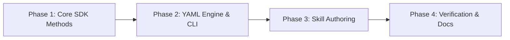

# Implementation Plan: `cxas-autolabel-rules` Skill & Tooling

* **Status:** Proposed
* **Design Doc Reference:** `docs/design/autolabel_rules_skill_design.md`
* **Target Package:** `cxas-scrapi`

---

## 1. Overview of Phases

The implementation is structured into 4 sequential phases:

1. **Phase 1 — Core SDK Operations**: Implement native `AutoLabelingRule` CRUD REST methods in `src/cxas_scrapi/core/insights.py`.
2. **Phase 2 — Declarative YAML Engine & CLI**: Implement YAML serialization, diffing logic, and `cxas insights autolabel` CLI subcommands.
3. **Phase 3 — AI Skill Scaffolding**: Create `.agents/skills/cxas-autolabel-rules/` with `SKILL.md`, CEL cookbook references, schema validation, and sync scripts.
4. **Phase 4 — Verification, Quality & Documentation**: Unit test coverage, formatters (`mdformat`, `ruff`), brand checks, and `AGENTS.md` registration.

---

## 2. Phase-by-Phase Task Breakdown

### Phase 1: Core SDK Extensions
**Files to touch:**
* `src/cxas_scrapi/core/insights.py`
* `tests/cxas_scrapi/core/test_insights.py`

**Tasks:**
- [ ] Implement `list_autolabeling_rules(parent, page_size)` using `_list_paginated`.
- [ ] Implement `get_autolabeling_rule(name)`.
- [ ] Implement `create_autolabeling_rule(auto_labeling_rule, auto_labeling_rule_id, parent)`.
- [ ] Implement `update_autolabeling_rule(name, auto_labeling_rule, update_mask)`.
- [ ] Implement `delete_autolabeling_rule(name)`.
- [ ] Add unit tests with mocked REST responses covering all CRUD operations.

---

### Phase 2: Declarative YAML Engine & CLI
**Files to touch:**
* New module: `src/cxas_scrapi/core/autolabel_sync.py`
* `src/cxas_scrapi/cli/insights_cli.py`
* `tests/cxas_scrapi/cli/test_insights_cli.py`

**Tasks:**
- [ ] Build YAML serializer / parser:
  * Export remote rules into structured `autolabel_rules.yaml`.
  * Load and validate local YAML rules against schema.
- [ ] Implement `diff_rules(local_rules, remote_rules)`:
  * Detect added rules, deleted rules, and modified fields (conditions, display name, active state).
- [ ] Implement `sync_rules(client, local_rules, force, dry_run)`:
  * Execute creations, updates, and conditional deletions.
- [ ] Register CLI commands under `cxas insights autolabel`:
  * `cxas insights autolabel pull --out <file>`
  * `cxas insights autolabel diff --file <file>`
  * `cxas insights autolabel push --file <file> [--dry-run] [--force]`
- [ ] Add unit tests for CLI argument parsing and sync/diff routines.

---

### Phase 3: AI Skill Scaffolding (`cxas-autolabel-rules`)
**Files to create:**
* `.agents/skills/cxas-autolabel-rules/SKILL.md`
* `.agents/skills/cxas-autolabel-rules/scripts/sync_rules.py`
* `.agents/skills/cxas-autolabel-rules/references/cel_cookbook.md`
* `.agents/skills/cxas-autolabel-rules/references/schema.json`

**Tasks:**
- [ ] Author `SKILL.md` with:
  * Natural Language $\to$ CEL formulation instructions.
  * Structural validation rules (fallback condition `""`, ordering, length constraints).
  * Clear step-by-step workflow: Intent analysis $\to$ YAML authoring $\to$ Diff $\to$ Push.
- [ ] Author `cel_cookbook.md` containing standard recipes:
  * Sub-agent routing (`get_last_subagent()`).
  * Session parameter extraction (`get_session_params()`).
  * Re-engagement flags (`has_same_caller_conversation_in_n_hours()`).
  * Sentiment and turn count thresholding.
- [ ] Add JSON Schema for `autolabel_rules.yaml`.
- [ ] Create `scripts/sync_rules.py` wrapper for scripted skill execution.

---

### Phase 4: Verification, Linting & Documentation
**Files to touch:**
* `AGENTS.md`
* `docs/guides/skills/index.md` (or mkdocs)

**Tasks:**
- [ ] Register `cxas-autolabel-rules` in `AGENTS.md` under `## Available Skills`.
- [ ] Format markdown files: `uv run mdformat .agents/skills/cxas-autolabel-rules/SKILL.md`.
- [ ] Run code formatters and linters: `uv run ruff check --fix` and `uv run ruff format`.
- [ ] Run full test suite: `uv run pytest`.
- [ ] Verify brand check passes: `uv run python3 scripts/check_brands.py --code-files`.

---

## 3. Success Criteria & Deliverables

| Deliverable | Verification Check |
| :--- | :--- |
| **Core SDK** | `list`, `get`, `create`, `update`, `delete` unit tests pass with 100% coverage. |
| **CLI & YAML** | `cxas insights autolabel pull/diff/push` works cleanly with sample YAML files. |
| **Skill** | `SKILL.md` passes `mdformat`, is registered in `AGENTS.md`, and guides CEL generation accurately. |
| **Pre-Commit** | `ruff`, `pytest`, and `scripts/check_brands.py` pass without warnings. |
