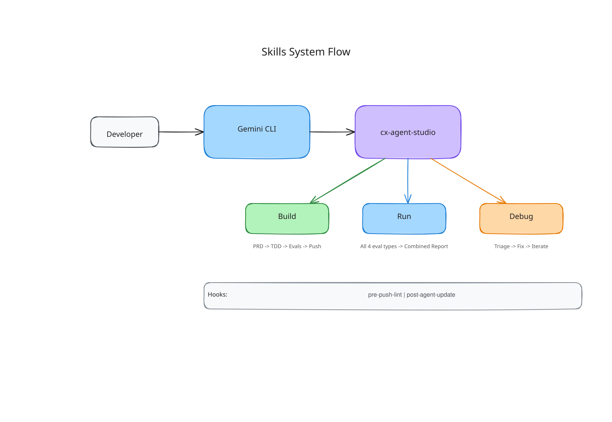

# AI Skills

SCRAPI includes an AI skills system that lets Claude Code and Gemini CLI operate as your AI development assistant for building CX Agent Studio agents. Instead of typing SCRAPI commands manually, you describe what you want in natural language and the AI handles the rest — from running PRD interviews to creating agents to running evaluations.

<figure class="diagram"></figure>

---

## What a skill is

A skill is a bundle of instructions, context, and scripts that an AI assistant uses to perform a specific task. Skills live in your project's `.agents/skills/` directory as folders, each containing a `SKILL.md` file.

The `SKILL.md` file has YAML frontmatter that declares the skill's name and description, followed by Markdown content that gives the AI detailed instructions on how to perform the task.

```
.agents/skills/
├── cx-agent-studio/
│   ├── SKILL.md              # The main composite skill
│   ├── references/           # Routed workflow references
│   ├── scripts/hooks/        # Hook scripts for pre-push and post-update
│   └── assets/               # Project templates
```

The AI reads the `SKILL.md` as part of its context. When you invoke the skill, the AI follows the router instructions and loads setup, build, run, debug, or simulation-eval conversion references as needed.

---

## How AI assistants pick up skills

### Claude Code

Claude Code automatically picks up skills from `.agents/skills/`. SCRAPI installs hooks into `.claude/settings.json` that run before and after relevant commands.

The skill is automatically triggered when you describe what you want:

```
Build a new CX Agent Studio agent for handling customer complaints
```

### Gemini CLI

Skills are also registered in `.gemini/settings.json`. Invoke from Gemini CLI with:

```
/cx-agent-studio
```

---

## The main skill: `cx-agent-studio`

`cx-agent-studio` is the router skill that covers the full agent development lifecycle. It keeps the always-loaded instructions short and routes to references for the specific workflow:

| Route | What it does |
|-----------|-------------|
| **Setup** | Configures a local workspace or connects to an existing app |
| **Build** | Runs a PRD interview, defines test cases, creates evals, and creates or edits the agent |
| **Run** | Runs eval types and generates reports |
| **Debug** | Analyzes failures, proposes fixes, and iterates toward the target pass rate |
| **Simulation eval conversion** | Converts CXAS golden evaluations into SCRAPI SimulationEvals |

The skill checks the current state of the environment and routes to the appropriate reference.

---

## Hooks

Skills can register hooks that run automatically at specific points in the development loop:

| Hook | When it runs |
|------|-------------|
| `pre-agent-push-lint.sh` | Before every `cxas push` — runs the linter |
| `pre-agent-push.sh` | Before every `cxas push` — detects drift |
| `post-agent-update.sh` | After the platform is updated — auto-syncs local files |

See [Hooks Reference](hooks.md) for details.

---

## The `gecx-config.json` file

Skills need to know which project and app to operate on. This configuration lives in `gecx-config.json` in your project root:

```json
{
  "gcp_project_id": "my-gcp-project",
  "location": "us",
  "app_name": "My Support Agent",
  "deployed_app_id": null,
  "model": "gemini-3.1-flash-live",
  "modality": "text"
}
```

The skills read this file to determine which app to build/run/debug.

---

## Getting started with skills

1. Install skills into your project: `cxas init`
2. Set up `gecx-config.json` with your project details
3. Open Claude Code or Gemini CLI in your project directory
4. Describe your task in Claude Code or use `/cx-agent-studio` in Gemini CLI

For a detailed walkthrough of the `cxas init` command, see [Installing Skills](installation.md).
