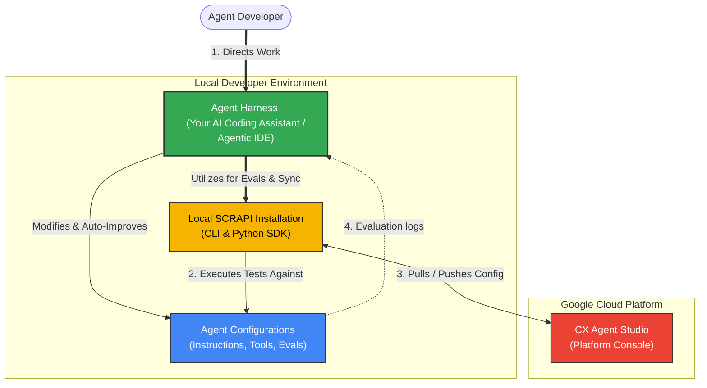

# Tutorial: Setting Up Your Agentic Development Environment

In this tutorial, you will set up a development environment that accelerates agent development using an agent harness and CXAS SCRAPI.

Instead of building agents entirely inside a web browser, you will configure a local environment that allows you to treat agent configurations as code. You will learn how to pair a local **agent harness** (e.g., an agentic developer environment like Antigravity) with **CXAS SCRAPI** to automate the agent development lifecycle, including bootstrapping, local evaluations, and self-improvement.



**What you'll have at the end of this tutorial:**

- A local development environment with SCRAPI and an agent harness that can interact with local agent configuration and the CXAS platform.
- A working agent with evaluations created based on an example PRD.
- A working understanding of how an agent harness utilizes SCRAPI to run local simulations and auto-improve your agent's configuration to add new capabilities.

---

## Step 1 — Configure Google Cloud & Permissions

Before configuring your local machine, you must ensure your Google Cloud Project is prepared and your developer identity has the necessary access.

1.  **Select a GCP Project**: Identify or create a Google Cloud Project with the **CX Agent Studio (CXAS) API** enabled.
2.  **Verify IAM Roles**: Ensure your Google Cloud identity (user account or service account) has been granted one of the following roles:
    *   `roles/ces.admin` (CX Agent Studio Administrator) — *Recommended for development*
    *   `roles/ces.agentEditor` (CX Agent Studio Agent Editor)
    *   `roles/ces.viewer` (CX Agent Studio Viewer) — *Minimum required for read-only evals*

!!! info "Detailed Permissions"
    For a comprehensive breakdown of what each role permits and how to grant them via the Cloud Console, see the **[Required IAM Roles](../getting-started/authentication.md#required-iam-roles)** section in the Authentication Guide.

---

## Step 2 — Set Up Your Local Environment

Next, you will set up your local environment, Python environment, and developer tools.

### 1. Install System Prerequisites
Ensure you have the following software installed in your environment:
*   **gcloud CLI**: Required to authenticate your local machine with Google Cloud. (Follow the [official gcloud installation guide](https://cloud.google.com/sdk/docs/install)).
*   **Agent Harness**: An agentic developer harness (like Antigravity) or an IDE equipped with an AI coding assistant (like VS Code).
*   **Source Control (e.g., Git)**: (optional) For version controlling your agent configurations in a multi-developer workflow.

### 2. Create a Virtual Environment
To prevent dependency conflicts, we recommend developing inside an isolated Python virtual environment.

=== "Using `uv` (Recommended)"

    `uv` is a Python package and environment manager.
    
    ```bash
    # 1. Create a virtual environment
    uv venv .venv
    
    # 2. Activate the environment (macOS/Linux)
    source .venv/bin/activate
    
    # 2. Activate the environment (Windows)
    .venv\Scripts\activate
    ```

=== "Using standard `venv`"

    If you prefer using Python's built-in tools:
    
    ```bash
    # 1. Create a virtual environment
    python3 -m venv .venv
    
    # 2. Activate the environment (macOS/Linux)
    source .venv/bin/activate
    
    # 2. Activate the environment (Windows)
    .venv\Scripts\activate
    ```

### 3. Install SCRAPI
With your virtual environment active, install the SCRAPI package from PyPI:

```bash
uv pip install cxas-scrapi
# or: pip install cxas-scrapi
```

!!! note "Python Version & Dependency Requirements"
    For detailed information on the required Python version and SCRAPI dependencies, check the **[Requirements](../getting-started/installation.md#requirements)** section in the Installation Guide.

---

## Step 3 — Configure Local Authentication

To allow SCRAPI and your agent harness to communicate with Google Cloud, you must configure local credentials. SCRAPI relies on Google's **Application Default Credentials (ADC)** to automatically resolve authentication.

For local development, the recommended approach is to use the `gcloud` CLI to log in and set up your active project. 

Follow the step-by-step terminal commands in the **[Local Development with gcloud CLI](../getting-started/authentication.md#local-development-with-gcloud-cli)** section of the Authentication Guide to authenticate your environment and set your default project before proceeding.

---

## Step 4 — Verify Your Setup with the SCRAPI CLI

Let's run a series of hands-on verification commands to confirm your local environment can successfully interact with the CXAS platform.

### 1. Test the CLI installation
Run the help command to ensure the `cxas` binary is registered and accessible:

```bash
cxas --help
```

### 2. Discover Your Cloud Apps
List the agent applications hosted in your GCP project:

```bash
cxas apps list --project-id YOUR_PROJECT_ID --location us
```

You should see a list of applications matching the ones in your CX Agent Studio console.

### 3. Pull Your First Configuration
Download a target application's configuration to your local machine:

```bash
cxas pull projects/YOUR_PROJECT_ID/locations/us/apps/YOUR_APP_ID
```

!!! note "Local Directory Structure"
    This command downloads your agent's cloud configuration and writes it as local code. Inspect your directory; you will now see:
    
    *   `agents/`: Contains instructions (YAML/txt) for your agents.
    *   `tools/`: Contains schemas and Python skeletons for your webhooks.
    *   `guardrails/`: Safety and policy files.
    *   `cxaslint.yaml`: The local linter configuration.

---

## Step 5 — Bootstrapping Totto from the F1 PRD in One Step

Now that your environment is set up, you are ready to build **Totto, the Mercedes F1 Fan Assistant**. 

Instead of manually creating folders, writing boilerplate code, or running multiple CLI commands, you will leverage the full power of your **agent harness** (your AI coding assistant) and SCRAPI. You will give the harness a single prompt to review the PRD, design the agent architecture, bootstrap the directory structure using SCRAPI, and write all the initial instructions and mock tools in one go.

### 1. The Bootstrapping Prompt
Open your agent manager and prompt your agent harness to bootstrap a CXAS agent and mock the tools.

!!! tip "Agent Harness Prompt Example: Bootstrap Agent Based on PRD"
    ```text
    Bootstrap a new agent named Totto_Mercedes_F1_Assistant in our workspace based on the PRD at examples/mercedes-f1-fan-agent/prd.md. Please:
    
    1. Use CXAS SCRAPI to bootstrap a new local agent project.
    2. Write the core system instructions for Totto following the PRD's personality and safety guidelines.
    3. Implement the mock tools using the SCRAPI mock_mode pattern for all tool requirements defined in the PRD.
    ```

---

### 2. What the Agent Harness Does Under the Hood

In response to your single prompt, the agent harness orchestrates the entire setup conceptually by utilizing your local SCRAPI installation and modifying your workspace files:

#### A. Scaffolds the Directory Structure
The harness calls SCRAPI to initialize the agent configuration, setting up standard project directories (such as `agents/`, `tools/`, and `evals/`) in your local workspace.

#### B. Writes Totto's System Instructions
The harness reads the PRD, and generates an optimized system prompt containing Totto's brand rules and safety guardrails. It writes this configuration directly into the agent's local instruction file.

#### C. Implements the Mocked Tools
The harness writes the necessary Python tool files in your `tools/` directory and implements mock responses using CXAS Python tool mock response configuration. 

For a detailed explanation of how to configure and use mock tool responses in your local evaluations, refer to the **[Mock Tool Responses Guide](../guides/evaluation/mock-tool-responses.md)**.

---

## Step 6 — Running Evaluations & Auto-Improving Your Agent

Now that the agent harness has bootstrapped Totto, let's explore the core value of local evaluations: implementing a **new capability** and verifying it before deployment.

Imagine you want to add a feature not defined in the initial PRD: a **Mercedes F1 Trivia Quiz Game**. You will walk through a Test-Driven Development (TDD) loop where you define the test first, observe it fail, and then have the harness implement the capability and verify it.

### 1. Defining the New Feature Test Scenario
Instruct the harness to create a local simulation test case for the trivia game.

!!! tip "Agent Harness Prompt Example: Create Evaluation"
    ```text
    Create a local user simulation to test a new capability: a Mercedes F1 trivia quiz. The simulated user should say: 'I want to play a trivia game'. The success criteria is that Totto enthusiastically hosts a 3-question Mercedes F1 history quiz, asking one question at a time and tracking the score. The test fails if Totto declines or does not know how to play.
    ```

**What the agent harness does under the hood:**
The harness writes a simulation configuration file in your local `evals/` directory, defining the user's starting intent (asking to play trivia) and the multi-turn success criteria.

### 2. Executing the Simulation (The Expected Failure)
Before writing any new instructions, instruct the harness to run the simulation to establish your baseline.

!!! tip "Agent Harness Prompt Example: Run Evaluation"
    ```text
    Use SCRAPI to execute our new trivia simulation and print the results.
    ```

**What the agent harness does under the hood:**
The harness writes a script that imports SCRAPI's evaluation SDK and executes the simulation locally. Since Totto was bootstrapped strictly from the initial PRD (which lacks trivia), the simulation **fails as expected**. Totto politely declines: *"I can help you with race schedules and merch support, but I don't have a trivia game."*

### 3. The Auto-Improvement Loop in Action (Adding the Capability)
Now, you will have the harness implement the new capability and verify the fix in one step.

!!! tip "Agent Harness Prompt Example: Fix Failing Evaluation"
    ```text
    The trivia simulation failed because Totto doesn't know how to play trivia. Update Totto's agent configuration to support a fun, 3-question Mercedes F1 trivia game when a user asks to play. Re-run the simulation using SCRAPI to verify and make changes until the new capability works.
    ```

**What the agent harness does under the hood:**
1.  It automatically opens the failed **Evaluation logs** and conversation transcript.
2.  It identifies the gap in the system instructions.
3.  It **directly modifies** the local system instruction file to inject the new capability: *"If the user asks to play a trivia game, act as the host of a fun, 3-question Mercedes F1 history quiz. Ask one question at a time, wait for their answer, and track their score."*
4.  It utilizes SCRAPI to **re-run** the simulation.
5.  It reports back: *"Simulation passed! Totto now successfully hosts the trivia game: 'Welcome to Mercedes F1 Trivia! Question 1: Who won the 2020 F1 World Championship for Mercedes?'"*

### 4. The Power of One-Step Iteration (The Agentic Shortcut)
While walking through these steps individually helps you understand the underlying mechanics of the TDD loop, in practice, you can delegate this entire feature-addition cycle to your agent harness in **one single prompt**.

Instead of manually creating the simulation file, running it to observe the failure, and then prompting for the fix, you can describe your intent and let the harness orchestrate the entire loop:

!!! tip "Agent Harness Prompt Example: One-Step Feature Iteration"
    ```text
    We want to add a new feature: a 3-question Mercedes F1 trivia quiz game. I want you to:
    1. Create a local user simulation in our evals directory that tests this feature (simulating a user asking to play, and expecting a multi-turn quiz).
    2. Update Totto's agent configuration to support this trivia game.
    3. Run the new simulation using SCRAPI, analyze any failures, and automatically iterate on the instructions until the test passes.
    ```

**What the Harness Does Under the Hood:**
The harness will automatically scaffold the simulation YAML, write the initial instruction updates, execute the SCRAPI simulation, capture the logs of any intermediate failures, auto-correct the instructions, and re-run the tests until it delivers a fully verified, passing feature implementation.

---

## Step 7 — Pushing to the Cloud (Platform Sync)

Once Totto has been thoroughly iterated on and auto-improved locally, you are ready to deploy. You will instruct the harness to push the verified configuration.

!!! tip "Developer Prompt to Agent Harness"
    *"Our Totto assistant is fully verified and passing all simulations. Use SCRAPI to push our local configurations to our live CXAS app at `projects/YOUR_PROJECT_ID/locations/us/apps/YOUR_APP_ID`."*

**What the agent harness does under the hood:**
The harness utilizes the local SCRAPI CLI to execute a push command, syncing your local instructions, mock-enabled tools, and configurations directly to the live CX Agent Studio platform.

---

## Summary & Source Control Workflow

Congratulations! You have successfully set up your agentic development workspace and built your first agent using an agent harness and SCRAPI.

### Your Source Control-First Workflow
Now that your workspace is ready, remember to treat **source control (e.g., Git)** as the source of truth for your agent's lifecycle when working with multiple developers on a single CXAS app:

1.  **Iterate Locally**: Use your agent harness to write code, modify instructions, and utilize SCRAPI to run local evaluations on feature branches.
2.  **Code Review**: Commit your YAML and Python changes to your repository and submit a Pull Request. Review changes and test logs with your team.
3.  **Merge & Deploy**: Merge approved changes into your main branch, and utilize SCRAPI's push command to deploy the verified configuration to CX Agent Studio.

---

## Next Steps

Now that your workspace is fully functional, try building a complete, production-grade agent by following the hands-on building tutorial:

*   **[Tutorial: Building a Restaurant Reservation Agent](restaurant-reservation.md)**
