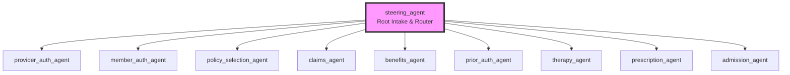

# Technical Design Document (TDD) / Business Requirements Document (BRD) — OptumCare Steering

> This is a **living document** — update it whenever requirements, agent behavior, or evals change. Update the TDD first, then update evals to match.

This document describes the complete design specification and requirements mapping for the **OptumCare Steering** conversational agent. It has been produced by reverse-engineering the active Customer Experience Agent Studio (CXAS) application files and synthesizing them with key requirement artifacts.

---

## Agent Design

### Architecture

The OptumCare Steering application utilizes a modular hub-and-spoke architecture. It consists of a single root agent (`steering_agent`) that manages conversational intake, intent classification, routing boundaries, and global error/timeout behaviors, alongside nine (9) highly specialized sub-agents.

#### Agent Scope & Roles
1.  **`steering_agent` (Root Agent):**
    *   **Scope:** Intent detection, caller type detection (provider vs. member), global safety/error handling, and routing.
    *   **Primary Goal:** Route the caller to the appropriate specialist sub-agent based on their role and authentication status.
2.  **`provider_auth_agent` (Sub-Agent):**
    *   **Scope:** Provider credentials verification (NPI and Tax ID).
    *   **Primary Goal:** Securely authenticate calling providers by systematically verifying their professional credentials.
3.  **`member_auth_agent` (Sub-Agent):**
    *   **Scope:** Member identification and authentication.
    *   **Primary Goal:** Securely authenticate members by verifying Member ID or performing an alternate demographic lookup (DOB, First Name, SSN).
4.  **`policy_selection_agent` (Sub-Agent):**
    *   **Scope:** Active policy retrieval and selection for members.
    *   **Primary Goal:** Guide the member in selecting their active coverage before routing to benefits or clinical specialists.
5.  **`claims_agent` (Sub-Agent):**
    *   **Scope:** Claims status, payment details, financial breakdowns, and dispute/transfer interception.
    *   **Primary Goal:** Retrieve detailed claim information for providers and assist with portal submission guidance for disputes.
6.  **`benefits_agent` (Sub-Agent):**
    *   **Scope:** Plan benefits summaries and eligibility tracking.
    *   **Primary Goal:** Execute coverage checks and explain eligibility status, copays, deductibles, and out-of-pocket limits.
7.  **`prior_auth_agent` (Sub-Agent):**
    *   **Scope:** Prior authorization status checking.
    *   **Primary Goal:** Verify specific prior authorization request status and direct new submission requests.
8.  **`therapy_agent` (Sub-Agent):**
    *   **Scope:** Therapy benefits tracking (Physical Therapy, etc.).
    *   **Primary Goal:** Retrieve and state visits allowed, visits used, and remaining visits.
9.  **`prescription_agent` (Sub-Agent):**
    *   **Scope:** Prescription benefits coverage.
    *   **Primary Goal:** Retrieve pharmacy networks, copays (tier 1 vs. tier 2), and mail order availability.
10. **`admission_agent` (Sub-Agent):**
    *   **Scope:** Admission notifications and Post Acute Care services.
    *   **Primary Goal:** Guide providers in submitting Post Acute Care notifications and provide system confirmation codes.

---

### Tools

All tools utilized by the agents are implemented as Python-based function tools. Each tool handles specific validation constraints and test-specific simulations.

| Tool Name | Type | Purpose |
| --- | --- | --- |
| `set_optum_care_state` | Python function | Persists critical session variables (`provider_tax_id`, `provider_npi`, `provider_auth_flag`, `member_individual_identifier`, `member_auth_flag`, `active_policy`, etc.) with formatting validations. Supports backend database failure simulation. |
| `verify_member_information` | Python function | Validates member identity demographic factors and registers `verified_member_id` and `verified_dob` in session state. |
| `auth_successful_handoff` | Python function | Sets `member_auth_flag = "Y"` to confirm successful authentication of members. |
| `search_claims` | Python function | Mock tool retrieving claims lists matching date of service or claims number. |
| `search_claim_details` | Python function | Retrieves payment breakdowns (paid amount, allowed amount, member responsibility, procedure codes, denial reasons) for a claim number. |
| `get_policies` | Python function | Retrieves active policy structures for a member individual identifier. |
| `CoverageLkup` | Python function | Queries coverage specifics (copay, deductible, out-of-pocket max, coinsurance) for a date of service and date range. |
| `get_benefits` | Python function | Retrieves standard eligibility status and plan details. |
| `get_therapy_benefits` | Python function | Retrieves therapy session limits and visits remaining. |
| `get_prescription_benefits` | Python function | Retrieves pharmacy networks and mail order status. |
| `check_prior_auth` | Python function | Retrieves active prior authorization request lists and statuses. |
| `submit_admission_notification` | Python function | Submits Post Acute Care admission details and returns a confirmation code. |
| `route_intent` | Python function | Sets context state intent classification (`headIntent`, `subIntent`). |
| `transfer_call` | Python function | Triggers telephony CTI transfer actions with reason codes (e.g., "M" for system error, "3" for escalation/representative requests). |
| `transfer_to_agent` | Python function | Directs agent state transitions. |
| `end_session` | System tool | Terminates the active voice session gracefully. |

---

### Routing Logic

Routing within the OptumCare Steering agent is governed by strict sequencing requirements, Turn 0 bypass checks, and global error constraints.

#### 1. Turn 0 Initialization and Bypass Rules
On Turn 0, the root agent inspects session parameters *before* playing any intake greetings:
*   **Direct Member Auth Bypass:**
    > If `{direct_member_auth_bypass} is set to "Y" or {callerType} is set to "member" or {Policy_askDOS_Toggle} is set to "ON" or {HoldOnGetDetails_Toggle} is not empty AND {member_individual_identifier} is empty or null: Absolutely do NOT play the default welcome greeting, do NOT ask if they are a provider or a member, and immediately route/transition to member_auth_agent.`
*   **Direct Provider Auth Bypass:**
    > If `{provider_npi_cache} is not empty or {callerType} is set to "provider" AND {provider_tax_id} is empty or null: Absolutely do NOT play the default welcome greeting, do NOT ask if they are a provider or a member, and immediately route/transition to provider_auth_agent.`
*   **Authenticated Member Bypass:**
    > If `{member_individual_identifier} is not null or {member_auth_flag} == "Y": Absolutely do NOT play the default welcome greeting, do NOT ask if they are a provider or member, and do NOT transfer or route to member_auth_agent. Immediately acknowledge their authenticated state exactly: "Hello, welcome to Optum. I see you are authenticated as a member. How can I assist you today?"`
*   **Authenticated Provider Bypass:**
    > If `{provider_tax_id} is not null or {provider_auth_flag} == "Y": Absolutely do NOT play the default welcome greeting, do NOT ask if they are a provider or member, and do NOT transfer or route to provider_auth_agent. Immediately acknowledge their authenticated state exactly: "Hello, welcome to Optum. I see you are authenticated as a provider. How can I assist you today?"`

#### 2. Member Specialist Sequencing Rule (Policy Enforcement)
For all member-specific inquiries, policy selection is a hard gating criteria:
> `For all member inquiries (benefits, therapy, prior auth, prescriptions, admissions), you MUST verify that a policy has been selected (i.e., context.state.active_policy is NOT empty and NOT null) BEFORE routing to the respective specialist agent. If active_policy is empty or null, you MUST route to policy_selection_agent first. This is a critical sequencing rule.`

#### 3. Global Exception & Error Handling Constraints
*   **System Errors:**
    > `If any backend failure, database error, system error, or technical breakdown occurs at any point (or if simulation reports database backend down), immediately say exactly "Sorry, we're experiencing some trouble. Let’s connect you to someone who can help." and call {@TOOL: transfer_call} with transfer_reason set to "M" and silentTransfer set to true, and end your turn.`
*   **Pacing and Timeouts:**
    > `If a caller reports that systems or the portal are taking a really long time to load, or if an initial pacing timeout occurs, first say exactly "Looks like systems are taking longer than expected on our end, so we appreciate your patience." Do NOT immediately transfer. If a second timeout occurs, or if user inactivity/prolonged delay persists after the initial prompt, immediately execute a transfer by saying exactly "Since we're having trouble, let's get someone to help you." and call {@TOOL: transfer_call} with transfer_reason set to "3" and silentTransfer set to true.`
*   **No User Input (Repeated Silence):**
    > `If the caller remains completely silent or if consecutive user inactivity (user_inactive) events occur, say exactly "I apologize, but I did not hear a response and have to end this call. Thank you for calling United Health Care. Goodbye." and immediately call {@TOOL: end_session}. This rule takes absolute priority over all transfer and escalation guidelines upon repeated silence UNLESS the first pacing timeout warning prompt ("Looks like systems are taking longer than expected...") has already been played in this conversation. If that warning has already been played, any subsequent inactivity event or silence indicates a persistent pacing difficulty, and you MUST trigger the pacing timeout transfer instead: say exactly "Since we're having trouble, let's get someone to help you." and call {@TOOL: transfer_call} with transfer_reason set to "3" and silentTransfer set to true.`
*   **Escalations and Hearing Issues:**
    > `If the caller requests an escalation to a representative or supervisor, indicates they cannot hear or understand responses (e.g., "I can't hear you", "You're breaking up"), or if they state they do not know whether they are a provider or member when asked, immediately say exactly "Let's get someone to better assist you." and call {@TOOL: transfer_call} with transfer_reason set to "3" and silentTransfer set to true.`
*   **Repetition Requests:**
    > `If the caller asks to repeat information or says "Can you repeat that?", exactly repeat the last stated claim details, payment breakdown, policy information, or question clearly and patiently. Do NOT time out, transfer, or end the call.`

---

## Agent Design

### Architecture

The OptumCare Steering application utilizes a modular hub-and-spoke architecture. It consists of a single root agent (`steering_agent`) that manages conversational intake, intent classification, routing boundaries, and global error/timeout behaviors, alongside nine (9) highly specialized sub-agents.

#### Agent Scope & Roles
1.  **`steering_agent` (Root Agent):**
    *   **Scope:** Intent detection, caller type detection (provider vs. member), global safety/error handling, and routing.
    *   **Primary Goal:** Route the caller to the appropriate specialist sub-agent based on their role and authentication status.
2.  **`provider_auth_agent` (Sub-Agent):**
    *   **Scope:** Provider credentials verification (NPI and Tax ID).
    *   **Primary Goal:** Securely authenticate calling providers by systematically verifying their professional credentials.
3.  **`member_auth_agent` (Sub-Agent):**
    *   **Scope:** Member identification and authentication.
    *   **Primary Goal:** Securely authenticate members by verifying Member ID or performing an alternate demographic lookup (DOB, First Name, SSN).
4.  **`policy_selection_agent` (Sub-Agent):**
    *   **Scope:** Active policy retrieval and selection for members.
    *   **Primary Goal:** Guide the member in selecting their active coverage before routing to benefits or clinical specialists.
5.  **`claims_agent` (Sub-Agent):**
    *   **Scope:** Claims status, payment details, financial breakdowns, and dispute/transfer interception.
    *   **Primary Goal:** Retrieve detailed claim information for providers and assist with portal submission guidance for disputes.
6.  **`benefits_agent` (Sub-Agent):**
    *   **Scope:** Plan benefits summaries and eligibility tracking.
    *   **Primary Goal:** Execute coverage checks and explain eligibility status, copays, deductibles, and out-of-pocket limits.
7.  **`prior_auth_agent` (Sub-Agent):**
    *   **Scope:** Prior authorization status checking.
    *   **Primary Goal:** Verify specific prior authorization request status and direct new submission requests.
8.  **`therapy_agent` (Sub-Agent):**
    *   **Scope:** Therapy benefits tracking (Physical Therapy, etc.).
    *   **Primary Goal:** Retrieve and state visits allowed, visits used, and remaining visits.
9.  **`prescription_agent` (Sub-Agent):**
    *   **Scope:** Prescription benefits coverage.
    *   **Primary Goal:** Retrieve pharmacy networks, copays (tier 1 vs. tier 2), and mail order availability.
10. **`admission_agent` (Sub-Agent):**
    *   **Scope:** Admission notifications and Post Acute Care services.
    *   **Primary Goal:** Guide providers in submitting Post Acute Care notifications and provide system confirmation codes.

---

### Tools

All tools utilized by the agents are implemented as Python-based function tools. Each tool handles specific validation constraints and test-specific simulations.

| Tool Name | Type | Purpose |
| --- | --- | --- |
| `set_optum_care_state` | Python function | Persists critical session variables (`provider_tax_id`, `provider_npi`, `provider_auth_flag`, `member_individual_identifier`, `member_auth_flag`, `active_policy`, etc.) with formatting validations. Supports backend database failure simulation. |
| `verify_member_information` | Python function | Validates member identity demographic factors and registers `verified_member_id` and `verified_dob` in session state. |
| `auth_successful_handoff` | Python function | Sets `member_auth_flag = "Y"` to confirm successful authentication of members. |
| `search_claims` | Python function | Mock tool retrieving claims lists matching date of service or claims number. |
| `search_claim_details` | Python function | Retrieves payment breakdowns (paid amount, allowed amount, member responsibility, procedure codes, denial reasons) for a claim number. |
| `get_policies` | Python function | Retrieves active policy structures for a member individual identifier. |
| `CoverageLkup` | Python function | Queries coverage specifics (copay, deductible, out-of-pocket max, coinsurance) for a date of service and date range. |
| `get_benefits` | Python function | Retrieves standard eligibility status and plan details. |
| `get_therapy_benefits` | Python function | Retrieves therapy session limits and visits remaining. |
| `get_prescription_benefits` | Python function | Retrieves pharmacy networks and mail order status. |
| `check_prior_auth` | Python function | Retrieves active prior authorization request lists and statuses. |
| `submit_admission_notification` | Python function | Submits Post Acute Care admission details and returns a confirmation code. |
| `route_intent` | Python function | Sets context state intent classification (`headIntent`, `subIntent`). |
| `transfer_call` | Python function | Triggers telephony CTI transfer actions with reason codes (e.g., "M" for system error, "3" for escalation/representative requests). |
| `transfer_to_agent` | Python function | Directs agent state transitions. |
| `end_session` | System tool | Terminates the active voice session gracefully. |

---

### Routing Logic

Routing within the OptumCare Steering agent is governed by strict sequencing requirements, Turn 0 bypass checks, and global error constraints.

#### 1. Turn 0 Initialization and Bypass Rules
On Turn 0, the root agent inspects session parameters *before* playing any intake greetings:
*   **Direct Member Auth Bypass:**
    > If `{direct_member_auth_bypass} is set to "Y" or {callerType} is set to "member" or {Policy_askDOS_Toggle} is set to "ON" or {HoldOnGetDetails_Toggle} is not empty AND {member_individual_identifier} is empty or null: Absolutely do NOT play the default welcome greeting, do NOT ask if they are a provider or a member, and immediately route/transition to member_auth_agent.`
*   **Direct Provider Auth Bypass:**
    > If `{provider_npi_cache} is not empty or {callerType} is set to "provider" AND {provider_tax_id} is empty or null: Absolutely do NOT play the default welcome greeting, do NOT ask if they are a provider or a member, and immediately route/transition to provider_auth_agent.`
*   **Authenticated Member Bypass:**
    > If `{member_individual_identifier} is not null or {member_auth_flag} == "Y": Absolutely do NOT play the default welcome greeting, do NOT ask if they are a provider or member, and do NOT transfer or route to member_auth_agent. Immediately acknowledge their authenticated state exactly: "Hello, welcome to Optum. I see you are authenticated as a member. How can I assist you today?"`
*   **Authenticated Provider Bypass:**
    > If `{provider_tax_id} is not null or {provider_auth_flag} == "Y": Absolutely do NOT play the default welcome greeting, do NOT ask if they are a provider or member, and do NOT transfer or route to provider_auth_agent. Immediately acknowledge their authenticated state exactly: "Hello, welcome to Optum. I see you are authenticated as a provider. How can I assist you today?"`

#### 2. Member Specialist Sequencing Rule (Policy Enforcement)
For all member-specific inquiries, policy selection is a hard gating criteria:
> `For all member inquiries (benefits, therapy, prior auth, prescriptions, admissions), you MUST verify that a policy has been selected (i.e., context.state.active_policy is NOT empty and NOT null) BEFORE routing to the respective specialist agent. If active_policy is empty or null, you MUST route to policy_selection_agent first. This is a critical sequencing rule.`

#### 3. Global Exception & Error Handling Constraints
*   **System Errors:**
    > `If any backend failure, database error, system error, or technical breakdown occurs at any point (or if simulation reports database backend down), immediately say exactly "Sorry, we're experiencing some trouble. Let’s connect you to someone who can help." and call {@TOOL: transfer_call} with transfer_reason set to "M" and silentTransfer set to true, and end your turn.`
*   **Pacing and Timeouts:**
    > `If a caller reports that systems or the portal are taking a really long time to load, or if an initial pacing timeout occurs, first say exactly "Looks like systems are taking longer than expected on our end, so we appreciate your patience." Do NOT immediately transfer. If a second timeout occurs, or if user inactivity/prolonged delay persists after the initial prompt, immediately execute a transfer by saying exactly "Since we're having trouble, let's get someone to help you." and call {@TOOL: transfer_call} with transfer_reason set to "3" and silentTransfer set to true.`
*   **No User Input (Repeated Silence):**
    > `If the caller remains completely silent or if consecutive user inactivity (user_inactive) events occur, say exactly "I apologize, but I did not hear a response and have to end this call. Thank you for calling United Health Care. Goodbye." and immediately call {@TOOL: end_session}. This rule takes absolute priority over all transfer and escalation guidelines upon repeated silence UNLESS the first pacing timeout warning prompt ("Looks like systems are taking longer than expected...") has already been played in this conversation. If that warning has already been played, any subsequent inactivity event or silence indicates a persistent pacing difficulty, and you MUST trigger the pacing timeout transfer instead: say exactly "Since we're having trouble, let's get someone to help you." and call {@TOOL: transfer_call} with transfer_reason set to "3" and silentTransfer set to true.`
*   **Escalations and Hearing Issues:**
    > `If the caller requests an escalation to a representative or supervisor, indicates they cannot hear or understand responses (e.g., "I can't hear you", "You're breaking up"), or if they state they do not know whether they are a provider or member when asked, immediately say exactly "Let's get someone to better assist you." and call {@TOOL: transfer_call} with transfer_reason set to "3" and silentTransfer set to true.`
*   **Repetition Requests:**
    > `If the caller asks to repeat information or says "Can you repeat that?", exactly repeat the last stated claim details, payment breakdown, policy information, or question clearly and patiently. Do NOT time out, transfer, or end the call.`

---

### Variables

The complete list of session variables declared in `app.json` and derived during runtime is detailed below. Labeling ensures test scripts do not attempt to override derived states.

| Variable Name | Source | Type | Description | Eval Overriding Policy |
| --- | --- | --- | --- | --- |
| `provider_tax_id` | Derived in Auth Tool | STRING | Tax ID of the authenticated provider. | **NEVER override in evals** |
| `provider_auth_flag` | Derived in Auth Tool | STRING | Authentication flag for provider (Y/N). | **NEVER override in evals** |
| `member_individual_identifier` | Derived in Auth Tool | STRING | Individual identifier of the member. | **NEVER override in evals** |
| `member_auth_flag` | Derived in Auth Tool | STRING | Authentication flag for member (Y/N). | **NEVER override in evals** |
| `call_claims_skill` | Derived in Router | STRING | Flag to indicate if claims skill should be called. | **NEVER override in evals** |
| `_action_trigger` | State-Setting Tool / Callback | STRING | Internal trigger for deterministic callback actions. | **NEVER override in evals** |
| `transfer_reason` | Telephony Platform | STRING | Reason code for transfer. | Session Parameter |
| `silentTransfer` | Derived in Router | BOOLEAN | Whether to transfer silently. | **NEVER override in evals** |
| `headIntent` | Derived in Tool | STRING | Top-level intent classification. | **NEVER override in evals** |
| `subIntent` | Derived in Tool | STRING | Granular sub-intent classification. | **NEVER override in evals** |
| `provider_npi` | Derived in Auth Tool | STRING | National Provider Identifier. | **NEVER override in evals** |
| `claim_list` | Derived in Tool | ARRAY | Cached list of retrieved claims. | **NEVER override in evals** |
| `claim_details` | Derived in Tool | OBJECT | Cached claim detail object. | **NEVER override in evals** |
| `repeat_counter` | Derived in Router | NUMBER | Conversation boundary tracking counter. | **NEVER override in evals** |
| `no_user_input_counter` | Derived in Callback | NUMBER | Silence instances tracking counter. | **NEVER override in evals** |
| `consumer_app_name` | Telephony Platform | STRING | Dynamic caller tenant app brand name. | Session Parameter |
| `error_msg` | Derived in Tool | STRING | Fallback escalation context message. | **NEVER override in evals** |
| `error_code` | Derived in Tool | STRING | Fallback escalation error reason code. | **NEVER override in evals** |
| `active_policy` | Derived in Policy Tool | STRING | Selected active policy name. | **NEVER override in evals** |
| `auth_system_error` | Derived in Auth Tool | STRING | Flag to indicate auth system error (Y/N). | **NEVER override in evals** |
| `callerType` | Telephony Platform | STRING | Testing: Signal to bypass root greeting. | Session Parameter |
| `provider_npi_cache` | Telephony Platform | STRING | Testing: Cached NPI. | Session Parameter |
| `provider_tin_cache` | Telephony Platform | STRING | Testing: Cached TIN. | Session Parameter |
| `direct_member_auth_bypass` | Telephony Platform | STRING | Flag to trigger Turn 0 direct member bypass. | Session Parameter |
| `Policy_askDOS_Toggle` | Telephony Platform | STRING | Toggle variable to prompt member for Date of Service. | Session Parameter |
| `Policy_askDateRange_Toggle` | Telephony Platform | STRING | Toggle variable to prompt member for Date Range. | Session Parameter |
| `HoldOnGetDetails_Toggle` | Telephony Platform | STRING | Toggle variable to prompt member to hold. | Session Parameter |
| `policy_DOS` | Telephony Platform | STRING | Active Date of Service for policy benefits inquiry. | Session Parameter |
| `policy_DateRange` | Telephony Platform | STRING | Active Date Range for policy benefits inquiry. | Session Parameter |
| `transfer_initiated` | Derived in Tool | STRING | Global tracking flag for transfers. | **NEVER override in evals** |

---

### Callbacks

In GECX, callbacks intercept runtime events to enforce strict, non-probabilistic behaviors. Currently, active runtime callbacks are mapped to the root agent for silence handling and downstream platform failures.

#### 1. `before_model_callback` (Root Agent)
*   **Trigger:** Intercepts the model call prior to generation.
*   **Deterministic Greeting:** Intercepts `<event>session start</event>` and returns exactly: `"Hi, I am your virtual assistant. How can I help you today?"`
*   **Deterministic Silence Handling:**
    *   Detects standard voice silence patterns (`<context>no user activity detected...</context>`).
    *   Turn 1 Silence: Repeats the last model message prefixed with `"Sorry, I didn't hear anything."`
    *   Turn 2 Silence: Repeats the message prefixed with `"I still can't hear you."`
    *   Turn 3 Silence: Says `"I'm sorry, but I'm unable to hear you. Please try calling again later. Have a great day."` and invokes the `end_session` tool.
*   **Deterministic Escalation Handoff:** Reads and clears `_action_trigger` to invoke `payload_update_tool` and `end_session` for downstream CRM updates.

#### 2. `after_model_callback` (Root Agent - Migrated Layer)
*   **Trigger:** Executes immediately post-generation.
*   **CTI Direct Redirection:** Intercepts user `conversationEnd` inputs and routes to the `conversationEndEventHandler`.
*   **Global NI Enforcement:** Forces silent transfers when the maximum no-input threshold is exceeded (`NICount >= 3`).

---

## Eval Design

### Coverage Map

| Requirement | Eval Type | Rationale | Priority | Severity | Tags |
| --- | --- | --- | --- | --- | --- |
| **Provider Auth Happy Path** | Golden | Validates dual-factor credentials mapping via deterministic slots. | P0 | NO-GO | `golden, provider-auth, happy-path` |
| **Provider Auth Unknown NPI Fallback** | Golden | Verifies graceful fallback prompts asking for Tax ID when NPI is unknown. | P0 | HIGH | `golden, provider-auth, fallback` |
| **Member Auth Happy Path** | Golden | Verifies Member ID, DOB, and First Name validation sequencing. | P0 | NO-GO | `golden, member-auth, happy-path` |
| **Member Auth Lookup Path** | Golden | Validates lookup triggers via DOB/SSN when Member ID is missing. | P0 | HIGH | `golden, member-auth, lookup` |
| **Member Lookup Refusal** | Golden | Ensures immediate representative transfer when user refuses to provide lookup credentials. | P1 | HIGH | `golden, member-auth, negative` |
| **Policy Selection - Toggles OFF** | Golden | Verifies immediate Coverage Lookup defaults when toggle is OFF. | P1 | HIGH | `golden, policy-selection` |
| **Policy Selection - Toggles ON** | Golden | Validates single-turn pacing asking for DOS and Date Range. | P1 | HIGH | `golden, policy-selection` |
| **Prior Auth New Inquiry** | Golden | Verifies deterministic intent routing to `newPriorAuth`. | P0 | HIGH | `golden, prior-auth` |
| **Benefits Disambiguation** | Golden | Verifies menu options presentation and subsequent eligibility intent routing. | P0 | HIGH | `golden, benefits` |
| **Claims Inquiry Routing** | Golden | Verifies intent classification routing to the Claims specialist. | P1 | HIGH | `golden, claims` |
| **System Backend Failure** | Golden | Ensures immediate transfer with reason "M" when middleware errors or database failures occur. | P0 | NO-GO | `golden, global-behavior, tech-diff` |
| **Chemotherapy Prior Auth** | Sim | Tests conversational goals and oncologist sub-intent status checking. | P0 | HIGH | `sim, prior-auth, oncology` |
| **Post Acute Care Admission** | Sim | Tests clarify-and-submit flows for Post Acute Care notifications. | P1 | HIGH | `sim, admission, post-acute` |
| **Simulated Downstream Bot Down** | Sim | Verifies the steering agent transfers the caller using reason "M" when sub-agents (Claims, Benefits, Auth) fail to load. | P0 | HIGH | `sim, tech-diff, down-bot` |
| **Out of Scope Member (Non-UHC)** | Sim | Verifies the agent gracefully identifies out-of-scope plans (e.g., Aetna) and denies service. | P1 | HIGH | `sim, steering, negative` |
| **Out of Scope Provider (Non-UHC)** | Sim | Verifies the agent gracefully identifies out-of-scope plans (e.g., Cigna) and denies service. | P1 | HIGH | `sim, steering, negative` |
| **Goodbye Immediate Exit** | Sim | Validates graceful session end when user greets and departs. | P2 | MEDIUM | `sim, steering` |

---

### Test Data

The following mock customer profile data must be utilized in all test scripts and evaluations to ensure consistency:

#### 1. Provider Profiles
*   **Valid Provider Profile A:**
    *   `provider_npi`: `1234567890`
    *   `provider_tax_id`: `987654321`
*   **Valid Provider Profile B:**
    *   `provider_tax_id`: `12345`
*   **Invalid Provider Profile:**
    *   `provider_npi`: `9999999999`
    *   `provider_tax_id`: `00000`

#### 2. Member Profiles
*   **Member Profile A (Single Active Policy):**
    *   `member_individual_identifier`: `M55555`
    *   `first_name`: `Jane`
    *   `dob`: `1985-05-20`
    *   Expected Policies: `[{"policyId": "P111", "policyName": "OptumCare Gold", "status": "active"}]`
*   **Member Profile B (Multiple Active Policies):**
    *   `member_individual_identifier`: `M12345`
    *   `first_name`: `John`
    *   `dob`: `1980-01-15`
    *   Expected Policies: `[{"policyId": "P111", "policyName": "OptumCare Gold"}, {"policyId": "P222", "policyName": "OptumCare Silver"}]`
*   **Invalid Member Profile:**
    *   `member_individual_identifier`: `INVALID_ID`
    *   `dob`: `INVALID_DOB`

#### 3. Downstream Failure Testing
*   **Claims Bot Failure Context:**
    *   `simulate_claims_bot_down`: `true`
*   **Middleware Error Context:**
    *   `mwFailure`: `true`

---

## Tracking

### Pass Rate History

| Date | Goldens | Sims | Tool Tests | Callback Tests | Notes |
| --- | --- | --- | --- | --- | --- |
| 2026-05-29 | 10/10 | 17/17 | 7/7 | 2/2 | Initial baseline reverse-engineered from active application files. |

---

### Known Issues

1.  **Downstream Middleware Mock Dependency:**
    *   All core search tools (`search_claims`, `search_claim_details`, `get_policies`, etc.) rely on mock data mappings. Real-world REST/gRPC integrations are currently pending under ticket `b/512979828`.
2.  **Direct Member Auth Turn 0 Pacing:**
    *   Turn 0 bypass routes immediately to Member Auth, skipping welcome messages. Evals must assert on the sub-agent greeting directly, which differs from standard hub intents.

---

### Changelog

| Date | Change | Author |
| --- | --- | --- |
| 2026-05-29 | Initial synthesization of comprehensive TDD/BRD covering multi-agent architecture, Turn 0 bypass rules, Coverage Map, and test data profiles. | GECX Agent |
